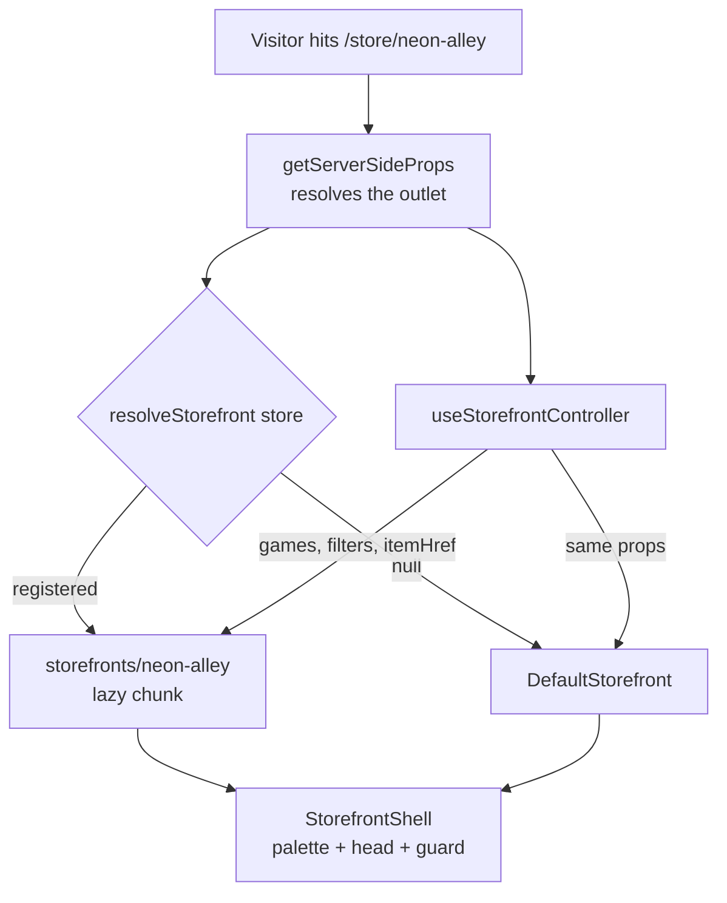

# Custom Storefronts

How an outlet gets a storefront that looks nothing like Manifold's, without losing any of the functionality that makes it a storefront.

Delivery status lives in [`custom-storefronts-tasks.md`](./custom-storefronts-tasks.md). This document covers the runtime design and the authoring workflow.

---

## The problem

Every outlet used to render byte-identically. `pages/store/[slug].tsx` handed endpoint strings to one shared `Storefront` component, so the only difference between two outlets was the logo in the nav, the name as a heading, and which games survived curation.

Multi-tenancy existed on the **catalogue** axis — `StoreTagFilter` and `StoreGameOverride` decide _which_ games an outlet shows — but not on the **presentation** axis. This is the presentation axis.

The design targets 10–50 hand-built outlets, never all of them. Code reuse between them is explicitly not a goal; blast-radius isolation is. Fifty independent directories is a directory, not spaghetti — one shared component with fifty layout flags is the thing to avoid.

## The shape



Three layers, and the split between them is the whole idea:

| Layer                                          | Lives in                                                  | Shared?                   |
| ---------------------------------------------- | --------------------------------------------------------- | ------------------------- |
| Controller — data, URL state, link building    | `components/storefront/useStorefrontController.ts`        | Always. Never overridden. |
| Shell — palette, document head, contract guard | `components/storefront/StorefrontShell.tsx`               | Always. Never overridden. |
| View — layout, copy, everything visible        | `components/storefront/default/` or `storefronts/<slug>/` | Swapped per outlet.       |

A theme is handed `games`, `featured`, `q`, `activeCategory`, `itemHref` and the rest as props. It never fetches, never knows an endpoint URL, never builds an href. That is what makes "same functionality, different face" hold in practice: the data is already in the theme's hands, so a theme that omits search is visibly unfinished rather than subtly broken, and a capability added to the controller lights up across every theme at once.

## The contract

`StorefrontViewProps` in `components/storefront/types.ts` is the full surface. The parts a theme **must** render:

| Marker                        | What it must be on                                 |
| ----------------------------- | -------------------------------------------------- |
| `data-storefront="search"`    | The search input. Submit it to `searchAction`.     |
| `data-storefront="filters"`   | The element wrapping the category links.           |
| `data-storefront="game-list"` | The element wrapping the catalogue.                |
| `data-storefront="game-link"` | Every link to a game, built with `itemHref(slug)`. |

`StorefrontContractGuard` checks all four in the browser during development and logs a console error naming the theme and the problem. It is not decoration: `tsconfig.json` sets `strict: false` and `strictNullChecks: false`, and even under strict TypeScript a component can accept `setQuery` and simply never render a search box — types prove props were _received_, never _used_. The repo has no frontend test setup either, so this guard is the only thing standing between a half-built theme and production.

Rules that are not machine-checked but matter just as much:

- **Never mirror `q`, `activeCategory`, `tags` or `order` into `useState`.** The URL is the source of truth. Mirroring breaks sharing a filtered view and breaks the back button.
- **Never hand-write `/item/${slug}`.** It drops the `?store=` param, and the sale stops attributing to the outlet. This is not hypothetical — the platform nav's search autocomplete did exactly this and quietly lost attribution for every visitor who searched from an outlet's own header.
- **Handle empty.** `featured` and `games` are both empty for a newly curated outlet.
- **Keep images in `public/storefronts/<slug>/`.** `next/image` throws at runtime for any host not listed in `remotePatterns` in `next.config.js`.

## Palette

`app/global.css` registers `--color-sf-*` tokens in an `@theme` block, giving Tailwind utilities like `bg-sf-bg`, `text-sf-accent`, `border-sf-border`. `StorefrontShell` overrides those tokens per outlet, so any shared component built from them recolours for free — which is how `StoreTopNav` and `StoreFooter` follow an outlet without either of them knowing outlets exist.

Three details are load-bearing and should not be "simplified":

- **The `sf-` namespace.** The site's default palette is light — `/about` and the auth pages depend on it — while every storefront is dark. Generic token names would leak an outlet's colours onto those pages.
- **Plain `@theme`, never `@theme static`.** Tailwind 4.2.2 silently drops a block marked `static`: no error, no tokens, no utilities, and `bg-sf-bg` compiles to nothing at all — which reads on screen as a transparent header rather than as a build failure. After any change here, grep the compiled stylesheet for `--color-sf-bg` rather than trusting the source.
- **`:root:root`, not `:root`.** Specificity 0,2,0 beats global.css's 0,1,0 whichever order the two stylesheets land in `<head>`, and that order is not guaranteed. A plain `:root` works in development and fails intermittently in production. This is what replaced the `background-color: #1d0f3b !important` blocks rather than multiplying them by fifty.

The palette is emitted through `next/head`, not styled-jsx — styled-jsx treats a fully-interpolated block as a _dynamic_ style and does not inline it during SSR, which is exactly the flash this design exists to avoid. Both `/store/[slug]` and `/item/[slug]` resolve their outlet in `getServerSideProps`, so the correct colours are in the first byte.

## Adding an outlet

1. `cp -r storefronts/_template storefronts/<slug>` — the directory name is the outlet's slug.
2. Rename `TemplateStorefront` → `<Name>Storefront` and `templatePalette` → `<name>Palette`.
3. Set the seven palette values.
4. Rewrite the layout. Keep the four markers and `itemHref`.
5. Optionally add `ItemPage.tsx` exporting a component typed `ItemViewProps`. Omit it and the outlet keeps Manifold's product page with its own palette.
6. Register it in `storefronts/registry.ts`:

```ts
const CUSTOM_STOREFRONTS: Record<string, CustomStorefront> = {
  "neon-alley": {
    Storefront: dynamic(
      () =>
        import("storefronts/neon-alley/Storefront").then(
          (m) => m.NeonAlleyStorefront,
        ),
      { ssr: true }, // never false: it reintroduces the flash and kills OG/SEO
    ),
    palette: neonAlleyPalette,
  },
};
```

Palettes are imported statically because SSR needs them before the lazy chunk resolves; the components are lazy so fifty outlets cost the first visitor nothing.

7. Walk the checklist below.

## Verifying an outlet

There is no frontend test suite in this repo. These are checked by hand or by driving Chromium (`PLAYWRIGHT_BROWSERS_PATH=/opt/pw-browsers`; do not run `playwright install`).

1. The outlet renders its own design; an unregistered outlet still renders the default.
2. Search submits, the URL gains `?q=`, results change, and back restores the previous view.
3. A category link filters, and the active state survives a hard reload.
4. Every game link carries `?store=<slug>` — including the platform header's autocomplete and its "View all results".
5. Clicking into a game keeps the outlet in the nav, and "Back" returns to the outlet rather than `/store`.
6. Redeeming sends `store_slug` in the POST body.
7. Navigating to `/about` and back leaves no colour behind.
8. Hard reload with cache disabled shows no flash, and View Source contains the palette.
9. The network panel shows the outlet's chunk is _not_ loaded on a default outlet.
10. 375px viewport is usable and the PWA `theme-color` matches.
11. The dev console shows no `[storefront contract]` errors.

## Moving the mapping into the database

Not built, and not needed below roughly fifty outlets. When it is:

`resolveStorefront` takes the store object rather than a slug precisely so this is a one-line change to its body — `CUSTOM_STOREFRONTS[store.theme_key ?? store.slug]` — with no call sites touched. Around it:

- A migration shaped like `20260722103832_add_store_logo_url`, adding one column.
- The `create:store | read:public_store | update:store` branch of `filterOutput` in `models/authorization.ts`. **Without this the column is invisible to the API and the theme silently never resolves** — `filterOutput` builds every response field by field and returns `{}` for anything it has no branch for, with no error.
- **`theme_key` must not go into `storeSchema`.** That schema is the entire owner-writable surface and `update()` re-parses it with `.partial()`, so an owner who can set their own `theme_key` can wear another outlet's identity. This is the same reasoning already documented for `commission_rate` in `prisma/schema.prisma`.
- Validate the value at write time and degrade to the default on read. There are no foreign keys in this schema, so nothing else will catch a stale key.
