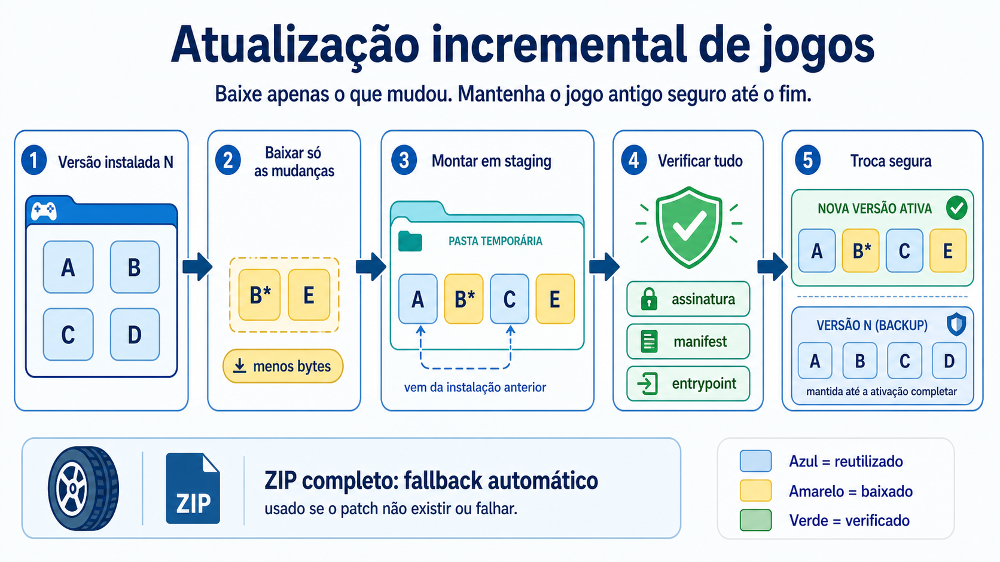
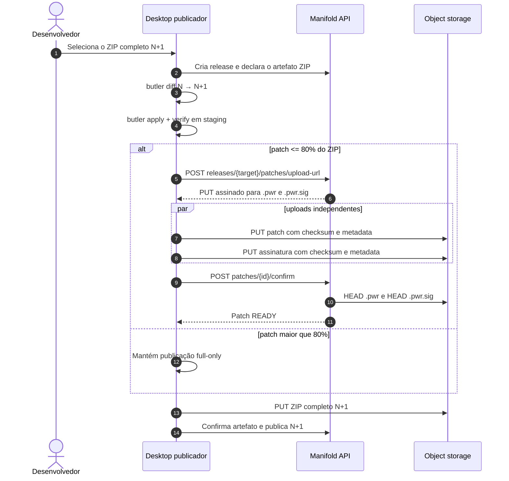
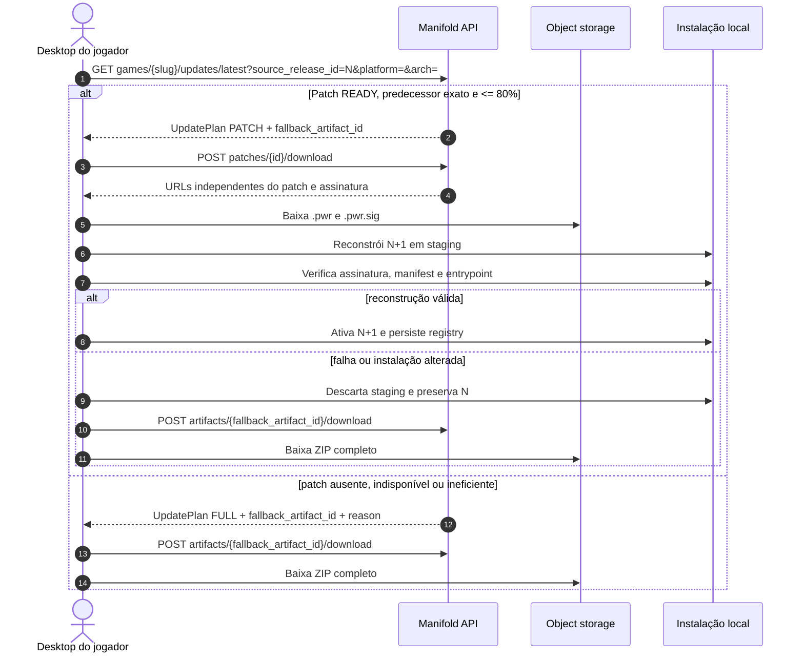

# Atualizações incrementais de jogos

Este documento é a fonte técnica oficial do protocolo de atualização incremental do Manifold. O contrato executável está em `contracts/desktop/v1.ts` e a descrição OpenAPI em `docs/openapi/manifold-desktop-v1.yaml`.



## Objetivo e baseline

O Manifold já distribui releases imutáveis por plataforma e arquitetura. Cada release publicada possui pelo menos um `GameArtifact` ZIP completo, manifest versionado, tamanho e SHA-256. Esse ZIP continua obrigatório: instalação, reinstalação e qualquer falha incremental sempre têm um caminho completo conhecido.

Antes desta mudança, o baseline confirmado do Desktop era de 59 testes TypeScript e 57 testes Rust passando. Após a implementação, a suíte completa do backend passou com 149 suítes e 1.026 testes; os quatro arquivos de integração incrementais somam 21 testes.

A atualização incremental acrescenta um `GameReleasePatch` entre duas releases compatíveis. A primeira versão cobre somente o predecessor compatível imediato. O Desktop publicador gera e valida localmente `patch.pwr` e `patch.pwr.sig` com Butler/Wharf; o backend não possui worker de geração.

Em termos simples:

```text
Instalação N:       [ A ][ B ][ C ][ D ]
Release N+1:        [ A ][ B*][ C ][ E ]
Download do patch:       [ B*]         [ E ]
Reuso local:        [ A ]      [ C ]
```

O Wharf divide arquivos em blocos de 64 KiB, encontra conteúdo reutilizável mesmo quando o alinhamento muda e representa dados novos em operações próprias. A assinatura de destino contém os hashes que provam o resultado reconstruído. Consulte [o algoritmo de diff do Wharf](https://itch.io/docs/wharf/algorithms/diff.html) e [o fluxo offline do Butler](https://itch.io/docs/butler/offline.html).

## Decisões congeladas da versão 1

- `algorithm` é sempre `WHARF` e `format_version` é sempre `"1"`.
- Um patch liga apenas a release compatível imediatamente anterior à próxima release para o mesmo `platform` e `architecture`.
- O plano usa `PATCH` somente se o registro está `READY` e `patch_size_bytes * 100 <= full_zip_size_bytes * 80`. O limite é inclusivo: exatamente 80% ainda é `PATCH`.
- Qualquer outra situação produz `FULL` com um motivo explícito.
- Todo `UpdatePlan` contém `fallback_artifact_id`.
- `expected_installation_sha256` é o SHA-256 da assinatura canônica de destino. No formato 1 ele deve ser igual a `signature.sha256`.
- Object keys são internos. O contrato não expõe campos `storage_object_key` nem `created_by_user_id`.
- Publicação usa `create:game_artifact`. Resolução e download exigem simultaneamente `read:library` e entitlement; nem o proprietário do jogo recebe exceção de leitura.
- Um patch `READY` é imutável. Retry da declaração devolve o mesmo patch e `uploads: null`, impedindo nova autorização de overwrite.

## Publicação



O publicador deve confirmar o patch antes de confirmar o artefato ZIP alvo. Na declaração, o backend exige:

1. source publicado e com ZIP `READY` para o target;
2. target ainda `DRAFT` ou `PROCESSING`, com ZIP completo já declarado;
3. mesmo jogo, plataforma e arquitetura;
4. source igual ao predecessor compatível exato;
5. algoritmo, formato, tamanhos e SHA-256 válidos;
6. hash esperado igual ao hash da assinatura canônica.

A confirmação executa `HEAD` independente nos dois objetos. Tamanho real, checksum S3, content type, patch id, papel (`PATCH` ou `SIGNATURE`), tamanho declarado e SHA-256 em metadata precisam coincidir. Ausência ou corrupção marca o patch `FAILED`; uma declaração idêntica pode então obter URLs novas e tentar novamente.

## Atualização do jogador



O plano não contém URLs. Essa separação evita guardar credenciais temporárias e permite renovar downloads sem recalcular a estratégia:

```text
1. GET  /api/v1/games/:slug/updates/latest  -> UpdatePlan
2a. POST /api/v1/patches/:patch_id/download -> patch + signature
2b. POST /api/v1/artifacts/:fallback_artifact_id/download -> ZIP completo
```

As variantes de `FULL.reason` são:

- `NO_PATCH`: não existe declaração para a transição;
- `SOURCE_NOT_PREDECESSOR`: a instalação está mais de uma release atrás;
- `SOURCE_UNAVAILABLE`: a source foi retirada ou deixou de estar publicada;
- `PATCH_NOT_READY`: o upload não foi confirmado ou falhou;
- `PATCH_EXCEEDS_SIZE_LIMIT`: o `.pwr` é maior que 80% do ZIP alvo.

## Persistência e integridade

`GameReleasePatch` não possui foreign keys. Referências a releases, artefatos e usuário são lógicas e validadas no model layer, seguindo a arquitetura do projeto. A unicidade é `(source_release_id, target_release_id, platform, architecture)`. Checks no banco garantem releases distintas, tamanhos positivos, duração não negativa, formato 1 e igualdade entre o hash esperado e a assinatura.

Os campos persistidos são:

- ids de source e target, plataforma e arquitetura;
- algoritmo, formato e status `PENDING | READY | FAILED`;
- tamanho, SHA-256 e object key internos do `.pwr`;
- tamanho, SHA-256 e object key internos do `.pwr.sig`;
- `expected_installation_sha256`, autor e `generation_duration_ms`;
- `created_at` e `updated_at`.

O backend volta a conferir os objetos antes de autorizar download. Uma divergência depois da confirmação produz `INTEGRITY_FAILURE`, sem emitir URLs. Retirada da release alvo produz `RELEASE_RETIRED`; patch pendente, source incompatível ou artefato indisponível não podem ser baixados.

O Wharf recomenda reconstruir arquivos alterados em staging e só consolidar depois de comparar a assinatura; em caso de mismatch, o staging pode ser descartado sem tocar na instalação ativa. Consulte [o algoritmo de aplicação do Wharf](https://itch.io/docs/wharf/algorithms/apply.html). O Desktop mantém backup até a nova release e o registry serem persistidos.

## Eficiência, métricas e empacotamento

É possível derivar por patch:

- `patch_ratio = patch_size_bytes / target_zip_size_bytes`;
- bytes economizados pelo `.pwr` em relação ao ZIP;
- duração declarada da geração;
- proporção de planos `PATCH` e `FULL` por motivo;
- falhas de confirmação, integridade, apply e fallback.

Não registrar URLs assinadas, cookies, headers de autenticação ou object keys. O identificador do patch e os ids de release são suficientes para correlação operacional.

O formato do jogo influencia a economia. A [documentação do SteamPipe](https://partner.steamgames.com/doc/sdk/uploading?l=english&language=english) recomenda localizar alterações, evitar reordenar assets, limitar pack files e preferir compressão por asset: compressão que cruza fronteiras espalha pequenas mudanças e aumenta o download. Essas práticas também favorecem o Wharf.

## Rollout

1. Aplicar migration e publicar o contrato v1.
2. Entregar o Desktop publicador com Butler fixado, geração, validação e retry.
3. Entregar o consumidor com staging, journal, cancelamento e fallback automático.
4. Publicar releases privadas N e N+1 com alterações controladas.
5. Validar patch saudável, limite de 80%, corrupção, retomada e fallback.
6. Habilitar produção sem remover artefatos completos nem releases históricas necessárias.
7. Acompanhar tamanho, duração, falhas e bytes economizados antes de considerar cadeias maiores que N → N+1.

## Referências

- [Wharf: cálculo de diferenças](https://itch.io/docs/wharf/algorithms/diff.html)
- [Wharf: aplicação de patches](https://itch.io/docs/wharf/algorithms/apply.html)
- [Butler: diff e patch offline](https://itch.io/docs/butler/offline.html)
- [Steamworks: upload e boas práticas do SteamPipe](https://partner.steamgames.com/doc/sdk/uploading?l=english&language=english)
