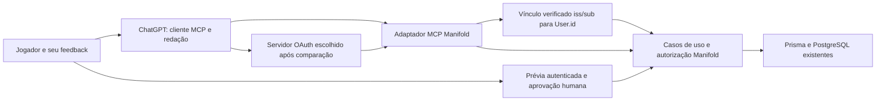

# Arquitetura vigente — catálogo público MCP

**Escopo autorizado: implementar somente leitura pública.** O desenho antigo com OAuth/reviews está preservado abaixo como histórico supersedido e não é gate do MVP.

## Composição MVC

Pages Router Node em `/api/mcp`; SDK oficial coordena MCP/Streamable HTTP. Adaptador valida protocolo e encaminha as duas operações; model do catálogo valida inputs, reaproveita game.findAllPaginated/localização e aplica projeção factual. Lookup por slug exige status público na consulta própria; não reutiliza findOnePublicBySlug sem filtro. Funções pequenas/componíveis, sem framework de casos de uso, servidor separado ou transação para leitura. Exemplos do repo: pages/api/v1/games/index.ts e models/game_localization.ts.

| Tool         | Entrada                                                                                                                                                          | Saída                                              | Política                                                                       |
| ------------ | ---------------------------------------------------------------------------------------------------------------------------------------------------------------- | -------------------------------------------------- | ------------------------------------------------------------------------------ |
| search_games | q: até 200 caracteres, default vazio; tags: até 5 termos de 64 caracteres; page: inteiro 1–100; limit: inteiro 1–20, default 10; locale: en/pt-BR, default pt-BR | games com slug/title/tags/launch_date e pagination | noauth; readOnlyHint=true, destructiveHint=false, openWorldHint=true           |
| get_game     | slug até 255 caracteres, locale en/pt-BR                                                                                                                         | game com a mesma allowlist                         | Mesma política; não encontrado/privado/inativo têm mesmo erro MCP sem conteúdo |

Inputs extras, preços, ordenação comercial, status privado e seletores de conta são recusados. Ordem inicial newest do domínio, tags hasSome (OR), texto case-insensitive em título/descrição/localização. Busca vazia permite descoberta; zero resultados é sucesso. Locale não é região comercial. Sem restrição por preço para catálogo informativo; não se afirma disponibilidade legal/comercial ou possibilidade de compra.

## Visibilidade e saída

ACTIVE/ONLY_DISPLAY são estados públicos atuais (models/game.ts:871–873). PRIVATE/INACTIVE não saem por busca, slug, count, pagination nem objetos relacionados. Tools permanecem públicas mesmo com cookie/Bearer/admin: sem resolver User e sem leitura privada no MVP. Criador/admin PRIVATE continuam em caminhos autenticados do domínio; os conflitos antigos ficam em evidências, sem corrigir rotas do site por antecipação.

Saída mínima factual: slug, title, tags limitadas e launch_date ISO/null. Não retornar descrição/detailed_description, media, social_links, preço/ofertas, requirements arbitrários, IDs internos, features/contas, reviews, biblioteca ou objetos Prisma. Texto do catálogo é dado, nunca instrução; remover markup/URLs explícitas dos campos exibidos e limitar tamanho. Isso não classifica toda prosa comercial nem comprova autenticidade do conteúdo. Sem links de página do jogo que possam iniciar compra. Não usar DTO comercial do site como saída do tool.

Paginações usam o filtro público antes de limit/count. Não prometer snapshot entre páginas durante mudanças concorrentes; ordenar/rebuscar não garante catálogo congelado. Status é revalidado em cada leitura; nenhuma resposta em cache compartilhado de dados privados. O endpoint não emite links/assets relacionados.

## Transporte, noauth e conexão

[OpenAI auth](https://developers.openai.com/plugins/build/auth) confirma modo anônimo e securitySchemes noauth por tool. SDK v2 suporta protocolo 2026-07-28 e clientes 2025 em modo stateless; compatibilidade concreta do host ainda deve ser testada. Sem OAuth discovery, profile, elicitation ou consentimento de escrita neste MVP. [SDK HTTP](https://ts.sdk.modelcontextprotocol.io/v2/serving/http.html).

Runtime Node Pages Router com bodyParser desligado para SDK controlar o corpo/limite. Host/Origin restritos ao origin da aplicação e loopback local conforme ambiente; ausência de Origin permite cliente MCP servidor-servidor, Origin estranho falha 403. Sem CORS wildcard ou flexibilização para contornar bloqueio. Endpoint HTTPS estável público para submissão; teste dev pode usar túnel oficialmente suportado com autorização posterior. [Conectar/testar](https://developers.openai.com/plugins/deploy/connect-chatgpt). Configuração de runtime/proxy/DB e teste real são próximos passos, não executados agora.

## Histórico supersedido — descoberta + reviews

O texto seguinte registra a primeira proposta e a atualização PRIVATE. Nenhuma operação OAuth/review descrita abaixo integra o MVP vigente.

# Arquitetura e fronteiras do adaptador mínimo

**Recomendação para debate.** Fatos de base estão em [evidências](01-evidencias.md); regras externas em [fontes](07-fontes.md). Nenhuma estrutura abaixo foi implementada.

## Responsabilidades

ChatGPT organiza feedback e chama ferramentas; não decide posse, identidade, permissões ou aprovação. OAuth identifica/limita o cliente; Manifold decide o que o usuário pode fazer. A gestão Peach é requisito do projeto, não uma integração comprovada no código. A frente de checkout do site não faz parte deste desenho.

Preferir um pequeno adaptador Node/TypeScript no repo atual, chamando os models/casos de uso diretamente. Não simular navegador ou fabricar cookie para chamar HTTP do próprio site. Reutilizar Zod, Prisma, erros e testes existentes; extrair apenas a política compartilhada de review que os callers realmente precisem. Evitar serviço remoto novo, fila, Redis, framework de agentes, migração de DB e importadores sob demanda no MVP.

Transporte remoto recomendado: **Streamable HTTP**, com endpoint e versão de protocolo negociados/testados; compatibilidade da hospedagem Pages Router precisa ser demonstrada em etapa futura. Não escolher SDK pela lista antiga da skill local. A [especificação de transporte](https://modelcontextprotocol.io/specification/2026-07-28/basic/transports/streamable-http) define o contrato; nem sucesso de handler unitário nem SDK instalado demonstram suporte de proxy/host. Usar biblioteca mantida, versão fixa e lockfile; não implementar protocolo manualmente. A revisão 2026-07-28 removeu GET stream e sessões de protocolo, e mudou elicitation para multi round-trip; não copiar contratos antigos sem negociar compatibilidade. Se o host exigir resposta SSE, testar fluxo/desconexão/timeouts no ambiente alvo antes de decidir arquitetura separada.

## Cinco operações centrais propostas

| Tool                   | Entrada mínima                                                            | Resultado/efeito                                                      | Autenticação                                                          | Anotações propostas `readOnly / destructive / openWorld` |
| ---------------------- | ------------------------------------------------------------------------- | --------------------------------------------------------------------- | --------------------------------------------------------------------- | -------------------------------------------------------- |
| `search_games`         | `query`, tags/locale/página/limite opcionais e limitados                  | Catálogo público, paginação coerente; sem efeitos                     | Anônima                                                               | `true / false / true`                                    |
| `get_game`             | slug                                                                      | Dados públicos filtrados do jogo                                      | Anônima                                                               | `true / false / true`                                    |
| `prepare_review_draft` | slug, texto, recommended; draft_id/expected_version para revisar rascunho | Persiste prévia privada ou nova versão; nunca publica                 | Identidade vinculada + consentimento de rascunho + feature de domínio | `false / true / false` (pode sobrescrever rascunho)      |
| `get_review_draft`     | draft_id                                                                  | Prévia exata e estado de aprovação/publicação do próprio usuário      | Identidade vinculada                                                  | `true / false / false`                                   |
| `publish_review`       | draft_id, expected_version                                                | Publica somente versão aprovada; consulta resultado anterior no retry | Identidade vinculada + consentimento de publicação + domínio          | `false / true / true`                                    |

A anotação conservadora `openWorld=true` de catálogo decorre do público aberto e da publicação pública; não de conexão de rede apenas. Reconfirmar durante revisão do metadata. Persistir prévia é escrita. Publicação merece confirmação do host além da prova no servidor. As [orientações de tools](https://developers.openai.com/plugins/plan/tools) tratam anotações como sinais para o cliente, sem substituir autorização.

Uma sexta tool opcional `get_profile`, sem argumentos, pode devolver ID opaco estável e rótulo mínimo para distinguir contas conectadas. Usar o contrato de perfil atual do host e derivar a conta das credenciais; não aceitar seletor de usuário. Não é pré-requisito para conexão, conforme [build MCP](https://developers.openai.com/plugins/build/mcp-server). Dados de outras contas, lista completa da biblioteca e exclusão de reviews não são necessários nesta primeira superfície.

Se edição de review publicada entrar no MVP, deve ter semântica explícita, alvo/versionamento próprios e teste de conflito. Não fazer upsert silencioso em `publish_review`. [Decisão D4](06-decisoes.md).

## DTO público com allowlist própria

Projeção inicial sugerida: slug, título, descrição curta em texto, tags, plataformas/requisitos públicos necessários, data de lançamento quando conhecida, resumo de reviews. Descrição detalhada, mídia e reviews de terceiros só se necessárias ao caso de uso, com limites e política explícita. IDs internos, status internos e timestamps operacionais não precisam sair; referências opacas de draft/publicação saem apenas por serem necessárias à jornada.

Aplicar a visibilidade ACTIVE/ONLY_DISPLAY **na consulta pública**, inclusive busca, detalhe, contagem/paginação e leitura de reviews. **Decisão de Pedro:** PRIVATE não é público, mesmo por link/slug. As tools públicas `search_games`/`get_game` continuam somente catálogo público, inclusive quando o cliente estiver conectado como admin; acesso privado não é necessário à descoberta/review do MVP. Se lojas/editoriais entrarem depois, usar somente revisão publicada, jamais draft/raw store; eles são domínio diferente de review do jogador.

Para a leitura privada em superfície autenticada própria do site, preservar acesso restrito a criador/proprietário e administrador real. O mapeamento operacional recomendado é `Game.studio_id → Studio.owner_id == User.id` ou capability atual `read:game:any`, com User existente/habilitado. O Game não registra autor individual do cadastro: essa interpretação de criador ainda precisa confirmação, sem inventar IDs ou migrar autoria. `publisher_id`, biblioteca, afiliação, ownership de Outlet e membership de estúdio/Outlet não concedem acesso sozinhos. Não reutilizar `update:game` ou `update:studio` como autorização de leitura privada: hoje ambos aceitam delegates. [Evidências dos papéis e dois testes conflitantes](01-evidencias.md#private-papeis).

**Recomendação pendente:** responder 404 para PRIVATE sem autorização, com corpo equivalente ao inexistente, evitando divulgar existência; o status HTTP não foi decidido por Pedro. Erros de credencial OAuth continuam seguindo o contrato de autenticação. Qualquer futura leitura privada via MCP precisa operação explicitamente protegida, token destinado ao recurso, consentimento, vínculo e autorização de domínio atuais; scope sozinho nunca concede acesso. Não adicionar essa operação ao MVP por antecipação.

A política precisa cobrir resultados de busca, detalhe API/SSR, paginação/contagens, reviews e agregados, editoriais associados, releases/manifests, mídia/links de download e caches: uma rota pública relacionada não pode revelar jogo PRIVATE por contornar o detalhe. Acesso privado permitido não torna dados relacionados irrestritos; cada recurso mantém suas próprias regras. Recomendar `private/no-store` nas respostas privadas e isolamento de cache por ator; testar transição ACTIVE→PRIVATE e remoção de permissões. Ocultar uma nova resposta não revoga automaticamente URLs de assets já emitidas ou cópias anteriores; storage/CDN exige avaliação específica na etapa de código. Esta rodada não audita nem altera esses endpoints. [Casos e limites](05-testes-ci.md#private-casos).

Não devolver preço, descontos, `purchase_mode`, `external_offer`, `social_links`, links de loja/checkout, dados de vendas/ledger/comissões/payout, email, password, tokens, features, biblioteca alheia ou objetos Prisma completos. A allowlist deve ser recursiva; novos campos do banco não entram automaticamente. O filtro atual `read:public_game` contém informações comerciais, portanto não basta encaminhá-lo sem redução.

Campos de texto também podem conter links e instruções. Remover markup e normalizar **antes da prévia**, limitar tamanho e validar URLs/protocolo/destino quando uma URL for permitida. Não renderizar HTML ou tornar qualquer link arbitrário clicável. Não encaminhar CTAs de compra dentro de descrições como atalho para a política. Se o feedback de review contiver conteúdo incompatível, devolver erro orientado à edição, sem alterar silenciosamente texto já aprovado. Sanitização não prova ausência de todo conteúdo comercial: fixtures adversariais e revisão de conteúdo permanecem necessários.

## Limites de publicação pública

A [política atual de plugins](https://developers.openai.com/plugins/plugin-guidelines) limita comércio a bens físicos, restringe produtos/serviços digitais e links que iniciem compra. O trecho de checkout externo não constitui exceção para jogos digitais. **Inferência aplicada ao Manifold:** compra de jogo digital, giftcard digital e redirecionamento que facilite essa compra ficam excluídos do plugin. Nenhuma tool compra/adquire/resgata, gera carrinho, link afiliado ou chama endpoint de biblioteca para produzir posse.

Uma página informativa e uma página de aprovação de review não são checkout; ainda assim, verificar seu conteúdo real. Não reutilizar `/item/[slug]` como link “informativo” sem revisar os CTAs presentes nas views. A opção proporcional inicial é não devolver links comerciais; a página de aprovação deve ser dedicada à review, sem upsell. Checkout independente continua outra frente.

Viabilidade técnica: adaptar domínio e autenticar cliente é plausível. Elegibilidade: exige cumprir política, utilidade própria, autorização das fontes externas do catálogo, conteúdo adequado ao público permitido, privacidade/suporte/identidade de publicação e revisão da OpenAI. Peach precisa confirmar quem será a entidade verificada e quais direitos tem sobre catálogo/marca. Esta investigação não atesta esses fatos nem aprovação futura. [Requisitos de revisão](https://developers.openai.com/plugins/deploy/app-review).

## Roteiro da redação

Pedir feedback específico e indicação explícita de recomendar ou não. Se o jogador disser apenas “quero uma review”, fazer uma pergunta sobre experiência; não fabricar uma. Pode organizar clareza/tom sem acrescentar horas jogadas, performance observada, plataforma usada ou elogios/críticas que não foram relatados. Manter incertezas (“ainda não terminei”) e não confundir recomendação de descoberta com review pessoal.

O servidor limita e valida o texto, mas não consegue provar que alguém jogou ou que cada frase é verdadeira. Aprovação estabelece consentimento sobre a versão, não veracidade da experiência. Proteger contra prompt injection de catálogo/reviews: tratá-los como dados, nunca como instruções para publicar; nenhuma chamada de ferramenta dispensará a aprovação humana. [Segurança e privacidade](https://developers.openai.com/plugins/guides/security-privacy).
