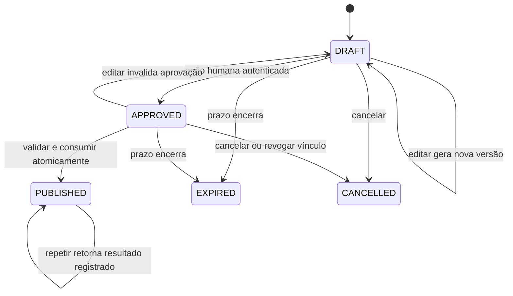

> **Etapa posterior — histórico preservado.** Reviews/aprovação saiu do MVP por decisão explícita de Pedro em 2026-10-01. Este documento não é gate nem autorização de implementação nesta rodada de catálogo público noauth.

# Prévia exata, aprovação humana e publicação

**Desenho proposto; nenhuma tabela/rota/tool criada.** Reutilizar domínio/testes existentes, adicionando apenas estado durável necessário. A jornada autorizada é review pessoal baseada no feedback do jogador.

## Preparar e editar

`prepare_review_draft` resolve o ator pelas credenciais, encontra jogo visível e confere feature/eligibilidade. Valida texto e recommended pelo mesmo contrato do site. A normalização definida (trim e eventuais regras de texto) ocorre **antes** de armazenar/exibir. O texto armazenado é a fonte da prévia; publicação não reescreve, traduz, sanitiza novamente ou “melhora” depois da aprovação.

Rascunho mínimo: ID opaco, User.id, game_id estável, versão inteira monotônica, message canônica, recommended, intenção create/update, alvo/revisão anterior quando aplicável, status, criado/expira. Aprovação pode ficar na própria linha do draft: actor/grant/vínculo, versão/digest aprovados, horário/validade e consumed/publication result. Evitar uma tabela/serviço de aprovações genérico até outro domínio realmente precisar. Não persistir transcrição completa, feedback bruto ou raciocínio do modelo por padrão.

O digest inclui esquema de canonicalização, usuário, game_id, intenção, versão, message exata, booleano recommended e eventual versão alvo. Usar serialização determinística sem ambiguidade; hash é compromisso de conteúdo, **não prova humana**. A prova é a transição efetuada pela interface autenticada do usuário. Não confiar em hash, assinatura ou token de aprovação que o cliente inventou.

Editar requer draft_id do próprio usuário e expected_version. Conflito de edição devolve versão atual sem sobrescrever. Qualquer alteração de texto/recomendação/jogo/intenção/alvo gera nova versão e limpa aprovação. Jogo/autor podem ser imutáveis por draft; mudar de jogo cria outro draft. Mesmo se o usuário retornar ao texto anterior, a aprovação antiga não revive. Rascunho de outro usuário retorna ausência sem conteúdo.

## Comparação de UX

| Caminho                                                  | Atrito                                                         | Evidência disponível ao servidor                                             | Decisão recomendada/limite                                                                                                         |
| -------------------------------------------------------- | -------------------------------------------------------------- | ---------------------------------------------------------------------------- | ---------------------------------------------------------------------------------------------------------------------------------- |
| Página Manifold dedicada, login web e botão de aprovação | Abre navegador; com sessão recente pode ser um clique após ler | Sessão verificada + POST protegido + draft/versão/digest lidos pelo servidor | Baseline mais simples e independente do host; não usar página de compra                                                            |
| Página com botão “Aprovar e publicar”                    | Uma ação humana final, sem voltar para pedir publicação        | Mesmas provas, commit de aprovação/publicação juntos                         | Alternativa menor em número de chamadas; botão deve comunicar claramente publicação imediata. Nesse modo MCP só consulta resultado |
| UI embutida via MCP Apps/host                            | Pode manter usuário no chat                                    | Depende do canal real de ação, autenticação e controles disponíveis          | Precisa sandbox. `widget.callTool`/metadata comum não demonstram por si só que a IA não pode reproduzir a chamada                  |
| Elicitation de formulário                                | Pode pedir aceite no chat                                      | Resposta protocolar correlacionada ao pedido                                 | Candidata apenas se host suportar e houver vínculo forte da resposta à versão; não presumir prova assinada de gesto humano         |
| URL elicitation                                          | Pode orientar abertura da página de aprovação                  | Navegação aceita não prova conclusão                                         | Mesmo fluxo web baseline; capability deve estar disponível. `action:accept` não marca APPROVED sozinho                             |
| Confirmação padrão do host ou “sim” no chat              | Poucos passos visíveis                                         | Sem contrato de prova servidor comprovado nesta investigação                 | Defesa adicional de UX; insuficiente para gravar aprovação pelo backend                                                            |

A [especificação elicitation](https://modelcontextprotocol.io/specification/2026-07-28/client/elicitation) distingue aceitar navegação de concluir interação e exige verificar a identidade de quem abre a URL. Não prometer suporte a form/URL em toda superfície do ChatGPT; negociar capability/version e testar. A [orientação OpenAI](https://developers.openai.com/plugins/guides/security-privacy) pede confirmação humana, mas não estabelece um recibo universal com conteúdo exato verificável no servidor.

**Recomendação baseline:** página dedicada, preenche tudo pela leitura do draft, mostra jogo/conta/texto completo/recomendação/versão/validade e botão “Aprovar esta versão”. Depois, `publish_review` consome a aprovação. Nenhuma segunda edição automática acontece entre os passos. Se Pedro preferir publicar no mesmo clique, o caso de uso é o mesmo e o tool de publish pode ser dispensado; escolha explícita de produto, não otimização oculta.

Minimizar atrito: preservar sessão web quando válida; exigir autenticação recente no vínculo/risco, sem pedir OTP a cada leitura pública; nenhuma pergunta redundante no chat após prova de aprovação válida, salvo safeguard exigido pelo host. Não prometer zero prompts de host/login. Abrir/GET/prefetch da URL nunca aprova nem publica.

## Aprovação verificável pelo servidor

Endpoint humano aceita apenas referência/versão esperada e CSRF. Busca no banco o conteúdo atual, confere sessão web e User.id igual ao draft e ao vínculo iniciador, validade e estado. O navegador deve ter carregado essa mesma versão; se mudou, apresentar a nova prévia e impedir aprovação do texto antigo.

Guardar actor, versão e digest aprovados, expiração e referência do grant/vínculo. Validar Origin/CSRF, usar cookie HttpOnly/Secure e evitar framing indesejado. Cookie SameSite sozinho não substitui essa análise. Referência de draft/challenge não é autorização: URL encaminhada, usuário errado ou challenge adivinhado não aprova. Resposta/log não contém sessão/token/OTP; link sem bearer. Sucesso de endpoint pressupõe controles implementados e testados, não prova biométrica de presença humana.

Prazo sugerido **para debate**, não valor já vigente: validade de aprovação de 10 minutos, draft de 24 horas, expiração determinada pelo relógio do servidor. Cancelar/editar/revogar vínculo invalida aprovação imediatamente. Expirar exige nova prévia/aprovação; não estender prazo por retry. Scope de publicação não serve como aprovação de qualquer conteúdo futuro.

## Publicar sem corrida ou duplicação

Uma chamada não recebe message/recommended/user_id “para publicar”; recebe draft_id/expected_version. O servidor obtém a versão aprovada armazenada e faz todas as validações. `confirmed:true`, `approved:true`, user_id, digest/approval_id fabricados e `action:accept` genéricos não alteram a máquina de estados.

Unidade atômica requerida: consumir aprovação + inserir/editar review + atualizar contadores/score + registrar resultado de publicação. O `review.add` atual abre sua própria transação e não retorna a review; apenas chamá-lo e depois consumir aprovação deixaria janela de duplicação/falha. Planejar pequena extração para aceitar transaction context e retornar resultado, compartilhada com o site, preservando testes existentes. As leituras de User/jogo/posse/review que decidem a escrita precisam do mesmo contexto transacional; helpers com Prisma global não bastam para essa garantia. Não duplicar cálculo de score na tool.

Dentro da unidade:

1. Validar ator/grant/vínculo atuais. Carregar e bloquear/condicionar draft e aprovação; comparar versão/digest exatos e validade.
2. Revalidar User existente, habilitado e feature `create:review`; jogo existente e ACTIVE/ONLY_DISPLAY; posse via política comum quando ACTIVE. Nunca criar biblioteca para passar checagem. Nintendo mantém semântica atual de `hasItem`.
3. Se create e review já existir, informar conflito, sem converter em update. Se update aprovado estiver no escopo, validar alvo e versão exata da review existente sob lock; conflito exige nova prévia.
4. Persistir texto/recomendação exatamente aprovados; atualizar agregados uma única vez; guardar review/result e consumo no mesmo commit.
5. Só após commit afirmar publicado. Se houve timeout após commit, retry com mesmo draft/versão devolve o resultado registrado. Se houve rollback, permanece sem publicação/consumo; erro retryable não autoriza nova escrita às cegas.

Chave idempotente natural: `(draft_id, approved_version, intent)` vinculada ao ator; unicidade de review continua defesa adicional. Dois drafts aprovados para mesmo usuário/jogo não produzem duas reviews. Resultado de draft já publicado só é acessível ao mesmo usuário autorizado; não exigir renovar aprovação expirada para consultar efeito já concluído. Se expected_version divergir, conflito, sem atribuir sucesso ao novo conteúdo.

**Concorrência de domínio exige desenho comum:** locks/CAS só no draft não impedem status/feature/posse mudarem. Proposta para avaliar: ordem consistente de locks de User, Game, LibraryItem existente, Review alvo e Draft; alterações concorrentes nesses registros esperam a transação, e todos os caminhos de review usam a mesma política. Ausência de biblioteca em ACTIVE nega. UPDATE/DELETE de registros bloqueados só ocorre após commit; então a linearização da publicação precede a alteração, sem promessa de anulação retroativa. Testar status/disable/remove entitlement simultâneos com barreiras reais.

Não afirmar que Serializable sozinho resolve writers de outros caminhos, nem que uma transação externa envolvendo `review.add` torna sua transação interna atômica. Se edição de review publicada for incluída, avaliar versão monotônica de review ou CAS robusto compartilhado com PATCH do site; `updated_at` não deve ser tratado como versão sem contrato/teste. Corridas de cálculo do score entre usuários diferentes também merecem teste sob lock do Game.

## Falhas e limites de produto

Sem aprovação, expirada/adulterada/outro usuário: negar com mensagem útil e sem conteúdo alheio. Mudança de visibilidade/posse/feature: negar, preservar rascunho privado conforme retenção e permitir retomar quando a regra permitir; não repetir publicação automaticamente após nova elegibilidade. Falha de auth/DB/status de revogação: fechar escrita, com retry limitado e resultado inequívoco.

**PRIVATE decidido por Pedro:** público não lê o jogo nem dados relacionados por possuir link/slug. Ser criador/proprietário ou admin pode autorizar leitura privada em superfície protegida; não torna PRIVATE revisável/publicável pelo plugin. Se o jogo muda para PRIVATE após aprovação, negar publicação e impedir que prévia/retomada revele dados do jogo a ator que perdeu autorização. Separar retenção interna do draft de permissão para devolvê-lo. Reviews antigas podem permanecer no banco sem serem expostas publicamente por caminhos relacionados; esta decisão não autoriza apagar dados nem define acesso a todo recurso associado. 404 para ocultar existência continua recomendação pendente. [Política e testes](05-testes-ci.md#private-casos).

O fluxo protege as escritas do plugin. A API web de review já permite publicação pelo usuário com cookie/feature, sem prévia do plugin; ela não foi alterada nem deve ser apresentada como sujeita à aprovação MCP. Compartilhar invariantes de domínio e conflitos evita corridas entre superfícies, mas não exige impor à escrita manual do site a jornada de IA. Não garantir que publicação futura oculta apague reviews antigas sem decisão separada de produto.
