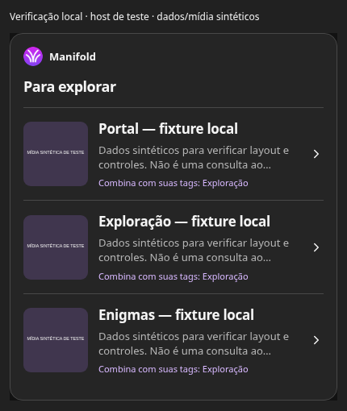
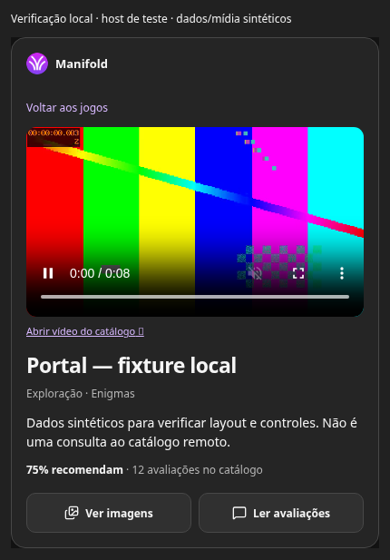
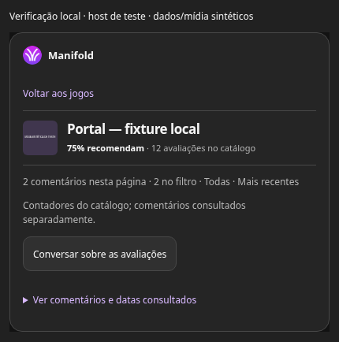

# Manifold: descoberta dentro da conversa

## Direção e limite da entrega

Implementação na branch `docs/manifold-mcp-peach-plan-20261001`, sobre `20c902934aa62c97a5fb4567f4c9a82084412d88`, preservando os commits anteriores. Pedro autorizou o conceito conversacional e a tentativa de autoplay mudo/inline. O incremento mantém três tools públicas de leitura, sem login, escrita de reviews, comércio ou mudança no checkout independente. A PR permanece draft; sem merge, produção ou publicação em diretório.

As três referências foram renderizadas e inspecionadas em Chromium antes de alterar o widget. O desbloqueio usou fonte textual autorizada, com SVG explicitamente neutro em lugar da arte fictícia. Isso reproduz a hierarquia/composição, não os pixels idênticos dos PNGs da Library. As referências e o host/composer simulados ficaram em scratch. Lume, Orbit Echo, Tiny Trails, porcentagens/opiniões fictícias não entram nos dados do produto.

## Fluxo entregue

1. `search_games` → seleção compacta com até cinco jogos reais retornados, imagem, descrição curta e tags. `matching_tags` contém somente tags retornadas do catálogo que correspondem aos filtros declarados; não transforma a ordem “newest” em recomendação pessoal. A explicação contextual mais ampla pertence à conversa e deve se apoiar nos dados consultados.
2. Seleção → `get_game` → um vídeo no topo, seguido por título/tags/descrição, contadores e duas ações secundárias: imagens disponíveis e leitura de reviews. Nenhuma etapa extra para “mostrar trailer”. O app usa logo real e tokens de cores/tipografia do host; acentos Manifold discretos, sem shell de storefront ou composer duplicado.
3. `get_game_reviews` → escopo compacto, número de comentários/filtro/ordem, contadores globais e evidências em disclosure. O widget não inventa temas nem opiniões. O clique de leitura consulta uma vez, oferece o resultado estruturado ao modelo e solicita análise na conversa apenas quando o host anuncia as capacidades correspondentes. Acknowledgement é aceitação da solicitação, não prova de resposta do modelo. Sem suporte/recusa/timeout, os comentários continuam consultáveis e a interface explica a falha.
4. Nova tool/seleção/cancelamento invalida a resposta pendente anterior. Troca de jogo desmonta e pausa o player. Notificações iniciais do host reutilizam o resultado, sem lookup duplicado.

Implementação: [widget](../../components/mcp/CatalogCard.tsx), [controller](../../components/mcp/catalog-card-controller.ts), [entry](../../components/mcp/catalog-card-entry.tsx), [CSS](../../styles/mcp-game-card.css), [contrato](../../contracts/public-game-catalog.ts), [projeção](../../lib/public-catalog-media.ts), [modelo](../../models/public_game_catalog.ts). Recurso `ui://manifold/game-card/v3.html`; CSP permanece restrito às origens de mídia já permitidas, sem connect/frame domains adicionais. A URI distinta não garante a política de cache do host.

## Reprodução e fallback

A tentativa configura muted/playsInline e chama play uma vez por fonte montada. Native controls mantêm play/pause/mute acessíveis; bloqueio deixa reprodução manual disponível, sem loop nem áudio forçado. Erro de rede/codec mostra a imagem disponível e o link de vídeo permitido, sem concluir que o catálogo não tem vídeo. A verificação encontrou e corrigiu uma corrida entre o erro do player e a rejeição de play que antes mostrava a mensagem de autoplay bloqueado.

MP4/WebM direto é preferido quando disponível. HLS usa capacidade nativa; YouTube permanece link externo, sem embed novo. Não se promete codec ou autoplay equivalentes em Chromium, Safari/iOS e ChatGPT. Sem vídeo, a projeção nova distingue `cover` de `screenshots` para preferir uma imagem declarada de gameplay; banner não vira gameplay por suposição. Todas as origens continuam na allowlist; conteúdo comercial/privado não é incorporado.

## Evidências visuais

Capturas abaixo são do widget realmente renderizado com o SDK oficial MCP Apps AppBridge e handlers locais de teste. Dados, comentários e mídia foram explicitamente sintéticos. O vídeo VP9/WebM de teste foi substituído na rede do browser somente para verificar decoder/controles; não é trailer real, não foi seedado remotamente e não é uma captura do ChatGPT. O uso de Portal no título da fixture não representa uma consulta remota.

| Seleção compacta                                   | Vídeo no topo                                            | Escopo/evidências de reviews                        |
| -------------------------------------------------- | -------------------------------------------------------- | --------------------------------------------------- |
|  |  |  |

A tentativa de salvar três novas capturas na Library falhou por rede antes de iniciar uploads; nenhum ID novo foi recebido. Não houve repetição ou mudança de rota na Library. As cópias desta documentação permitem revisar os pixels no repositório.

## Testes e limites

| Cenário → ação                                                                    | Resultado/invariante                                                                     | Evidência/gate                                                    | Limitação                                                                  |
| --------------------------------------------------------------------------------- | ---------------------------------------------------------------------------------------- | ----------------------------------------------------------------- | -------------------------------------------------------------------------- |
| Busca com tags; leitura de detalhe                                                | Match só de tags efetivamente retornadas; leitura pública continua ACTIVE/ONLY_DISPLAY   | Caso de uso SDK → HTTP → PostgreSQL e POST MCP; CI Jest existente | Fixture não comprova qualidade de recomendação nem dataset remoto          |
| PRIVATE/INACTIVE, cookies/Bearer e URLs rejeitadas                                | Sem ampliação de visibilidade ou projeção; sem comércio/autores privados                 | Integrações e projeção de mídia; CI Jest                          | Noauth permanece contrato; não testa OAuth nem permissões reais de hosting |
| Nova resposta do host durante seleção pendente; input/cancelamento                | Resposta antiga não substitui novo jogo; mídia stale é desmontada                        | Novo teste do controller; CI Jest                                 | Host fake testa nosso estado, não políticas do ChatGPT                     |
| Clique de reviews                                                                 | Uma consulta → evidência real dessa resposta → mensagem após acknowledgement             | Controller e browser SDK; CI Jest para lógica                     | Aceitação da mensagem não garante síntese ou citação pelo modelo           |
| Contexto recusado/sem capacidade/mensagem recusada; troca durante acknowledgement | Sem alegação de envio bem-sucedido, sem pedido antigo; evidências preservadas            | Controller + browser com recusa explícita; CI Jest para lógica    | Contrato real ChatGPT pendente                                             |
| Sem mídia/sem trailer; capa vs screenshot; texto não confiável                    | Ausência honesta, gameplay só da origem declarada, escaping React, sem compositor/compra | Markup e projeção; CI Jest                                        | SSR não executa efeitos nem prova playback                                 |
| Autoplay aceito, pausa, troca de jogo                                             | Um player mudo/inline com controles; player anterior pausado                             | Browser Chromium + vídeo sintético decodificado                   | Não prova trailer real, codec iOS ou policy do host                        |
| Autoplay recusado; erro de rede                                                   | Uma tentativa; manual disponível ou imagem/link de fallback                              | Browser com NotAllowedError e falha de rede explícitos            | Injeção testa tratamento, não reproduz integralmente uma sandbox real      |
| 320px, tema claro/escuro, evidências expandidas                                   | Sem overflow horizontal, foco/controls sem navegação profunda/scroll interno             | Inspeção/render browser                                           | VoiceOver e controles nativos em iOS pendentes                             |

[Teste do controller](../../tests/unit/components/mcp/catalog-card-controller.test.tsx) cobre erros e concorrência de estado. [Markup](../../tests/unit/components/mcp/CatalogCard.test.tsx) verifica a composição; [projeção](../../tests/unit/lib/public-catalog-media.test.ts) verifica o limite público. Reaproveitam-se [POST MCP](../../tests/integration/api/mcp/post.test.ts) e [jornada SDK/HTTP](../../tests/integration/_use-cases/public-catalog-mcp-flow.test.ts), sem criar frontend test framework ou camada de tools adicional.

Validação inicial: 244 suítes / 1.568 testes / 0 snapshots, 442,289 s, exit 0. Depois da correção de falha de mídia: 244 suítes / 1.568 testes / 0 snapshots, 405,499 s, exit 0; typecheck MCP e browser passaram. Prettier/ESLint completos passaram. O build final passou (exit 0); o trace `.next/server/pages/api/mcp.js.nft.json` inclui `public/mcp/game-card.html`; CI/Vercel são confirmados na PR pelo SHA final, sem usar o verde de um commit anterior. Números não demonstram sandbox/qualidade semântica; o aviso legado de open handles do Jest não foi omitido.

## Pipeline proporcional e homologação

Em Node 24.13.1, com Docker local e configuração de desenvolvimento: `npm ci`, `npm run test`, `npm run lint:prettier:check`, `npm run lint:eslint:check`, `npm run typecheck:mcp`, `npm run build`. `pretest`/`prebuild` geram o mesmo HTML do recurso; o trace da API MCP deve incluir esse arquivo. Não usar credenciais/dados de produção para fixture. Executar a suíte inteira de forma serial; encerrar serviços pelo posttest; restaurar somente alterações automáticas próprias no next-env.

A CI existente executa a suíte inteira e lint; nenhuma alteração de workflow nesta rodada. O typecheck MCP é verificado localmente, mas ainda merece gate dedicado no workflow por detectar contratos SDK/DTO que o build pode não bloquear. O browser permanece evidência manual: um gate posterior deve empacotar host/fixtures explícitos e validar estados/codec, sem alegar que substitui o sandbox ChatGPT. Não há razão para acrescentar OAuth, storage de preferências, novos scopes ou camada de aprovação de escrita nesta entrega de leitura.

Pendentes no host real: renderização do recurso v3, capacidades de contexto/mensagem, resposta conversacional grounded, permissões/CSP, autoplay mudo, link externo, trailer real, Safari/iOS/VoiceOver e comportamento de cache. Nenhum resumo de opinião aparece sem consultar comentários. O pacote privado existente não precisa mudar de identidade/configuração para consumir o servidor atualizado; não é publicação pública.

## Fontes oficiais

- [OpenAI: What makes a great ChatGPT app](https://developers.openai.com/blog/what-makes-a-great-chatgpt-app) e [UI guidelines](https://developers.openai.com/plugins/concepts/ui-guidelines): capacidades/contexto da conversa e UI leve.
- [OpenAI: MCP Apps/Pizzaz](https://developers.openai.com/plugins/build/chatgpt-ui#explore-the-pizzaz-component-gallery): bridge/recursos; não garante autoplay.
- [MCP Apps SDK oficial](https://github.com/modelcontextprotocol/ext-apps): contratos de App/AppBridge/styles inspecionados no pacote 2.0.3 instalado, incluindo capabilities, acknowledgement e contexto que só conserva a última atualização.
- [MDN: Autoplay](https://developer.mozilla.org/en-US/docs/Web/Media/Guides/Autoplay): Promise de play, mídia muda e política do browser; [Permissions Policy](https://developer.mozilla.org/en-US/docs/Web/HTTP/Reference/Headers/Permissions-Policy/autoplay).
- [Playwright: Page/route](https://playwright.dev/docs/api/class-page#page-route): substituição explícita de mídia só na verificação; ferramenta instalada em scratch, sem dependência nova do produto.
