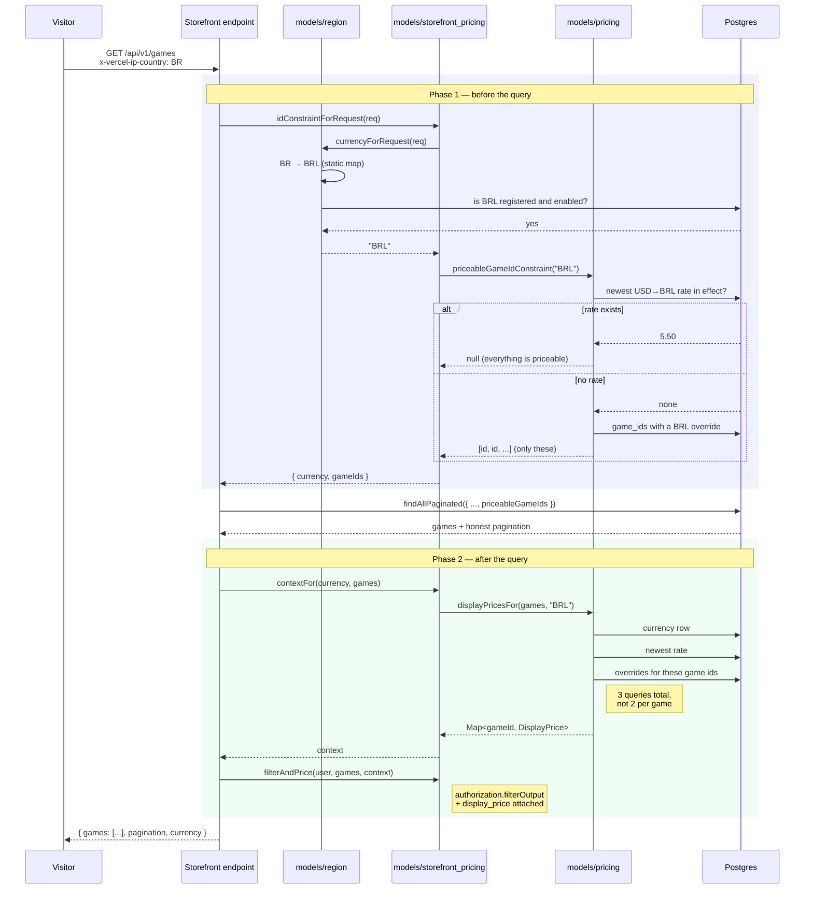
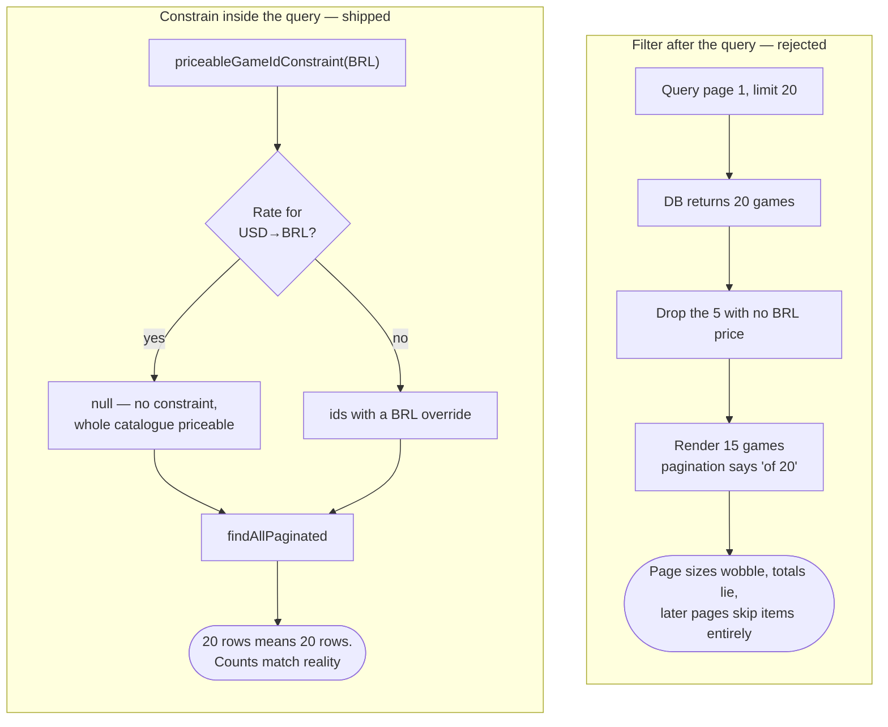
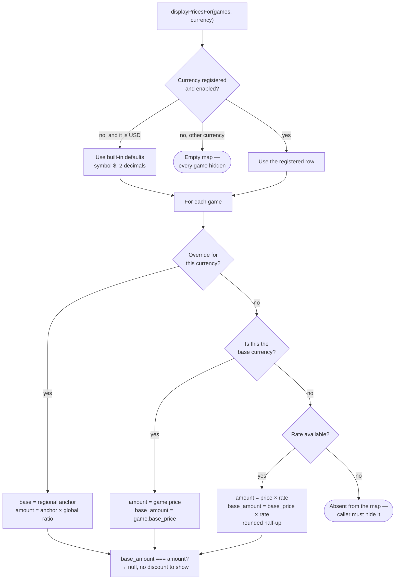
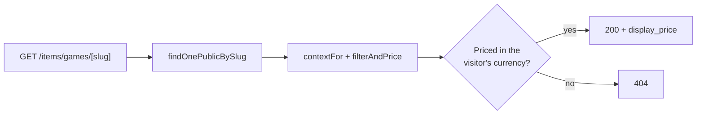

# Payments — Storefront Pricing Architecture

How a game gets a price in the visitor's currency, and why the pieces are split the way they are.

Delivery plan and task status live in [`payments-tasks.md`](./payments-tasks.md). This document covers the runtime design of the pricing path only.

---

## The modules

| Module                         | Responsibility                                   |
| ------------------------------ | ------------------------------------------------ |
| `models/region.ts`             | Which currency should this visitor see?          |
| `models/pricing.ts`            | What does this game cost in that currency?       |
| `models/storefront_pricing.ts` | Everything a storefront read needs, in one place |
| `lib/price.ts`                 | How the frontend formats what came back          |

## Why `storefront_pricing` exists

Seven endpoints emit `read:public_game` output:

| Endpoint                                 | Surface                  |
| ---------------------------------------- | ------------------------ |
| `GET /api/v1/games`                      | global catalogue         |
| `GET /api/v1/items/games/[slug]`         | product detail           |
| `GET /api/v1/stores/[slug]/featured`     | store storefront         |
| `GET /api/v1/stores/[slug]/trending`     | store storefront         |
| `GET /api/v1/stores/[slug]/new-releases` | store storefront         |
| `GET /api/v1/stores/[slug]/search`       | store storefront         |
| `GET /api/v1/library`                    | nested, owned items only |

Localising each separately means the same five steps copied seven times, and the failure mode that creates is specific: **a storefront where the same game costs a different amount depending on which carousel you found it in.** A shop that never localises is more trustworthy than one that localises inconsistently.

`GET /api/v1/library` is deliberately excluded. It lists games the user already owns, where a current price is not just irrelevant but misleading.

## Request flow



## Why two phases

The constraint must go **inside** the query; pricing can only happen **after** it. Collapsing them breaks one or the other.



The common case costs nothing: every game has a USD base price, so **one exchange rate makes the whole catalogue priceable** and the constraint is `null`. The expensive branch only runs when a currency is enabled but has no rate — where, by definition, few games have overrides.

## Resolving a single price



Two branches deserve special care when changing this:

**An override is a regional base-price anchor.** With no global promotion it is
the final local price and `base_amount` is null. During a global promotion, the
same `price / base_price` ratio is applied to the anchor and the anchor becomes
`base_amount` — USD 100 → 50 with a BRL anchor of 200 therefore resolves as BRL
200 → 100. Under ordinary conversion both USD sides still convert by the same
rate, so the same rule holds without an override.

**The base currency works unregistered.** With zero currency rows the platform still sells in USD, and localisation is strictly additive on top of a working default. An earlier draft returned an empty map here, which would have emptied the entire storefront the moment it shipped unconfigured.

## The shape of a storefront endpoint

```ts
const { currency, gameIds } =
  await storefrontPricing.idConstraintForRequest(req);

const { games, pagination } = await game.findAllPaginated({
  priceableGameIds: gameIds,
  ...result.data,
  order: "featured",
  curationWhere,
});

const context = await storefrontPricing.contextFor(currency, games);

return res.status(200).json({
  games: storefrontPricing.filterAndPrice(req.context.user, games, context),
  pagination,
  currency,
});
```

`filterAndPrice` calls `authorization.filterOutput` internally — the security boundary is unchanged, just no longer duplicated at each call site.

The detail endpoint differs, because it has no query to constrain:



The 404 is deliberate: a game with no local price is absent from every listing, so its detail page has to agree, or a shared link opens a product that cannot be bought and has no price to show.

`filterAndPrice` drops unpriced games regardless of caller, so no path can leak a wrongly-priced game even if a future endpoint forgets to apply the constraint.

## Response shape

Additive. `price` stays the untouched USD base, so a client that has not been updated keeps working.

```json
{
  "price": "12.00",
  "base_price": "20.00",
  "display_price": {
    "amount": "66.00",
    "base_amount": "110.00",
    "currency": "BRL",
    "symbol": "R$"
  }
}
```

`lib/price.ts` formats it, falling back to `price` with a `$` for any surface not yet passing through this path.

## Adding a currency to a new market

1. Register the currency in the backoffice (`/backoffice/currencies`).
2. Record a USD→XXX rate (`/backoffice/exchange-rates`). At this point the whole catalogue is purchasable there.
3. Optionally set per-game regional base-price anchors for commercially-shaped
   prices, via `PUT /api/v1/items/games/[slug]/prices/[currency]`. Global
   promotions are applied proportionally after this anchor is selected.

If the country is not in `COUNTRY_CURRENCY` in `models/region.ts`, add it — that map is the only thing connecting a region to a currency.

Between steps 1 and 2 the currency is enabled but has no rate, so **only games with an explicit override are visible** to visitors in that region. That is intentional, not a bug: it lets a market be opened progressively rather than all at once.
