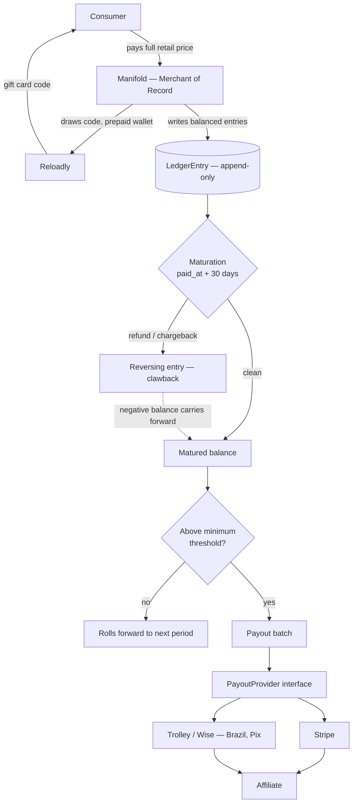
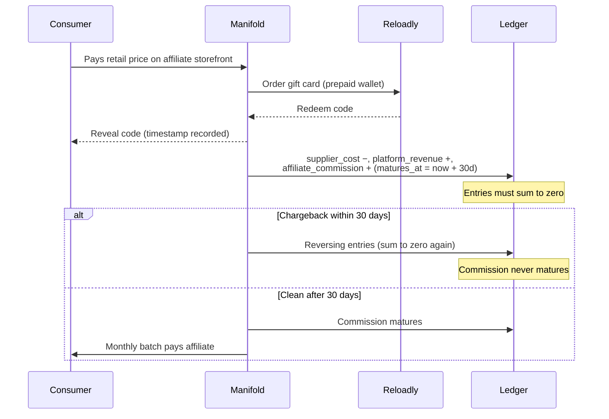

# Payments — Ledger & Payouts Task Breakdown

Delivery plan for [#177](https://github.com/pedromello/manifoldpowered.com/issues/177) (Milestone 3: Payment Structure — Sales and Payouts).

**Status: under review. Do not implement yet.** This document is the input for a public design discussion; the sequence below is expected to change before any code is written.

Each task is a separate small PR, landed in order, with `npm run test` passing on its own before merge — the same format as `docs/backoffice-tasks.md`.

---

## The model in one paragraph

Manifold is the **merchant of record**. Consumers buy gift cards from us; storefront owners are **marketing affiliates** who never take title, never set prices and never touch consumer money. We collect the full payment, hold the affiliate's commission for 30 days so refunds and chargebacks can resolve, then pay a **periodic lump sum** per affiliate — a real fiscal payment against a statement, the way Steam pays developers. This is deliberately *not* a per-transaction payment split.

## Money flow

## One sale, end to end

---

## Tasks

### 1. Foundation — features, fixtures, checklist

**TLDR:** Register the eleven new permission strings before anything else exists, and fix the tests that assert the old permission list.

Nothing on this platform can be built before its features are registered in `AVAILABLE_FEATURES` (CLAUDE.md, non-negotiable). This task adds the payments group, assigns each to the right progression tier, and writes a `filterOutput` branch per feature — that function returns `{}` for unhandled features, so a missing branch silently empties the response body rather than failing loudly.

The catch: adding features to `ACTIVATED_USER_FEATURES` changes an array that four existing test files assert with whole-object equality. They must be updated in the same PR or it lands red.

**Done when:** features registered, tiers assigned, filters written, existing fixtures green, and a decision recorded on how existing admins get the new admin features (`feature_backfill.ts` does not reconcile admin-only features today).

---

### 2. Schema + migration

**TLDR:** Three new tables — `LedgerEntry`, `PayoutAccount`, `Payout` — with money as integer minor units and no foreign keys.

`LedgerEntry` is append-only (no `updated_at`), carries a **signed** `amount_minor`, and references its source polymorphically (`source_type` + `source_id`) so it can point at a `Sale` today and an `Order` later without a migration. `Payout` gets a uniqueness constraint on `(user_id, period_start, period_end)` so a re-run can't double-pay.

**Done when:** migration created via `npm run migrate:create` and the suite passes.

**⚠ Hardest decision in the sequence.** The repo stores money as `String @db.VarChar(20)`. This introduces integer minor units for ledger tables only, knowingly leaving two money representations in the codebase. Reversing this after the table has live rows means a data migration.

---

### 3. Ledger model

**TLDR:** The accounting core — write balanced entry sets, never update a row, reverse by writing negatives.

`record()` accepts a set of entries and **rejects any set that does not sum to zero**. That single invariant is what makes the ledger auditable: every money movement is balanced by construction, and a bug that loses money fails at write time instead of surfacing in a payout three weeks later. `reverse()` writes a new negative entry rather than mutating the original, so history is never rewritten.

**Done when:** balance and matured-balance queries work, the zero-sum rule has unit tests, and the orchestrator can seed ledger entries.

---

### 4. Provider interface + Stripe adapter

**TLDR:** Make the payout rail swappable before writing the first one.

Four methods — `createAccount`, `getAccountStatus`, `sendPayout`, `getPayoutStatus` — with a registry keyed on the `provider` column. Stripe implements it first; an in-memory fake implements it for tests so the payout path is exercisable without network.

**Why it matters:** Stripe's cross-border payout coverage doesn't reach every market we'll have affiliates in, and Brazil is the likely first gap. Adding a provider later must mean writing an adapter, not migrating a table.

**Done when:** the fake and Stripe adapters satisfy the same interface and the call sites never import a provider directly.

---

### 5. Payout account model + endpoints

**TLDR:** Affiliates register where their money should go; nothing is payable until verification passes.

Create and read a `PayoutAccount`, with `payouts_enabled` defaulting to false. The output filter must never expose the provider's external account ID — or, later, tax identifiers.

**Done when:** both endpoints follow the standard router chain, validate with Zod, and pass every response through `filterOutput`.

---

### 6. Maturation + clawback

**TLDR:** The 30-day hold, implemented as a batch job.

Commission becomes payable at `matures_at` if no reversing entry exists against its source. A chargeback writes the reversal; if the commission was already paid out, the negative balance carries forward against future earnings.

This repo has **no scheduler**, so this follows the existing precedent for batch work: a model function returning a report, callable from a `tsx` script, a GitHub `workflow_dispatch` job, and an admin-gated endpoint that writes an audit log entry.

**Done when:** a matured balance excludes anything reversed, and a clawback after payout produces a carried negative balance.

---

### 7. Payout run

**TLDR:** Monthly batch — pay everyone whose matured balance clears the threshold and whose KYC is done.

Writes the `Payout` row and its balancing ledger entries in one transaction, then calls the provider. Sub-threshold balances roll forward with no row written. Idempotent per period.

**Done when:** the run is safely re-runnable, blocked for unverified accounts, and audit-logged.

---

### 8. Affiliate-facing reads

**TLDR:** Let affiliates see their own earnings — and nothing else.

Statement and payout history endpoints, gated by the base feature in the router plus a resource-scoped ownership check in the handler. **Never** buyer personal data, never gift card codes.

**Done when:** an affiliate can see their own numbers and provably cannot see another store's.

---

## Open questions

These are the points taken to public review rather than settled internally:

1. **Money type** — integer minor units for the ledger while the rest of the codebase uses decimal strings. Two representations, or migrate everything?
2. **Scope** — ledger and payouts first, with checkout and an `Order` model later. Is the polymorphic source reference the right seam?
3. **Tax fields** — deferred until the tax position is written, with payouts hard-gated meanwhile. Right call, or does the schema need them from day one?
4. **Currency/FX** — the codebase has no currency column at all today. Who bears conversion cost when we collect in BRL and pay in USD?
5. **Scheduling** — batch jobs are manually triggered (script / workflow / admin endpoint) because there's no scheduler. Does a payout system need a real one before launch?
