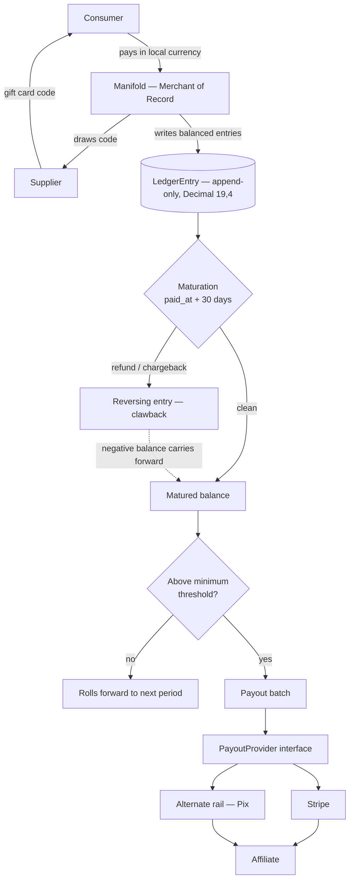
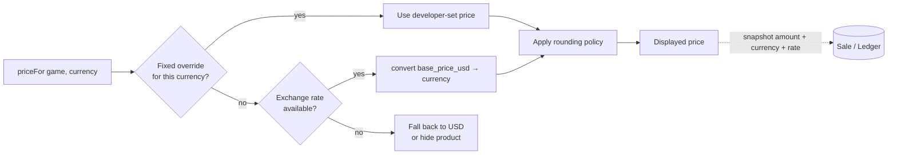
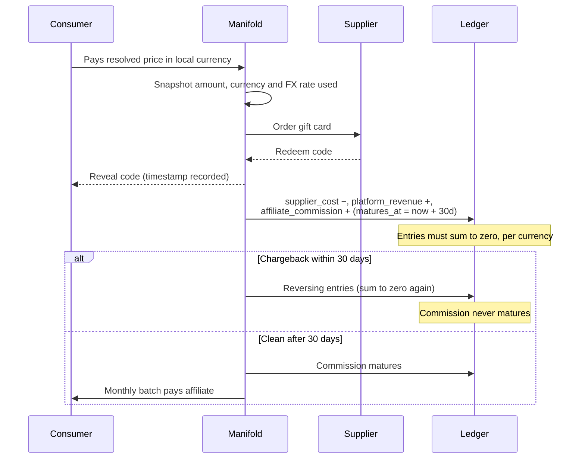

# Payments — Ledger, Multi-Currency Pricing & Payouts

Delivery plan for [#177](https://github.com/pedromello/manifoldpowered.com/issues/177) (Milestone 3: Payment Structure — Sales and Payouts).

**Status: under review. Do not implement yet.** This document is the input for a public design discussion; the sequence below is expected to change before any code is written.

Each task is a separate small PR, landed in order, with `npm run test` passing on its own before merge — the same format as `docs/backoffice-tasks.md`.

---

## The model in one paragraph

Manifold is the **merchant of record**. Consumers buy from us; storefront owners are **marketing affiliates** who never take title, never set prices and never touch consumer money. We collect the full payment, hold the affiliate's commission for 30 days so refunds and chargebacks can resolve, then pay a **periodic lump sum** per affiliate — a real fiscal payment against a statement, the way Steam pays developers. This is deliberately *not* a per-transaction payment split.

## Settled decisions

These are no longer open. They constrain everything below.

- **Money is `Decimal(19,4)`** everywhere — ledger, prices, payouts. Four decimal places is the standard scale for tax-inclusive amounts, where intermediate calculations need more precision than the two decimals a currency displays. This replaces the current `String @db.VarChar(20)` convention, and existing money columns migrate to it (task 2) rather than leaving two representations in the codebase.
- **USD is the base currency.** Every product carries a USD price. Other currencies are derived.
- **Price resolution is override-first:**
  ```
  priceFor(game, currency) = fixedPriceOverride(game, currency)
                          ?? convert(game.base_price_usd, currency)
  ```
  A developer-set fixed price for a currency always wins. Absent one, the price is converted from USD.

## Money flow



## Price resolution



## One sale, end to end



---

## Tasks

### 1. Foundation — features, fixtures, checklist

**TLDR:** Register the new permission strings before anything else exists, and fix the tests that assert the old permission list.

Nothing on this platform can be built before its features are registered in `AVAILABLE_FEATURES` (CLAUDE.md, non-negotiable). This task adds the payments group, assigns each to the right progression tier, and writes a `filterOutput` branch per feature — that function returns `{}` for unhandled features, so a missing branch silently empties the response body rather than failing loudly.

The catch: adding features to `ACTIVATED_USER_FEATURES` changes an array that four existing test files assert with whole-object equality. They must be updated in the same PR or it lands red.

**Done when:** features registered, tiers assigned, filters written, existing fixtures green, and a decision recorded on how existing admins get the new admin features (`feature_backfill.ts` does not reconcile admin-only features today).

---

### 2. Money representation — migrate to `Decimal(19,4)`

**TLDR:** Convert existing money columns from decimal-as-string to real numeric, before building anything financial on top of them.

`Game.price`, `Game.base_price` and `Sale.price_at_sale` are `String @db.VarChar(20)` today. That already forces raw `::numeric` SQL for range filters in `game.findAllPaginated`, and makes `orderBy: { price: "asc" }` sort lexicographically, which is subtly wrong. Building a ledger on a second, different representation would lock that split in permanently.

Migration is a hand-written SQL data migration (precedent: `20260723060000_lowercase_store_tag_filters`) doing `ALTER TABLE ... USING price::numeric`.

**Watch out:** Prisma returns `Decimal` objects, not numbers. Every API response must serialise them explicitly in `filterOutput` — the same treatment `GameFile.size_bytes` already gets with `.toString()`. Zod input schemas keep accepting a number and convert on the way in.

**Done when:** no money column is a string, price sorting and range filters use native numeric comparison, the raw `::numeric` workaround in `game.findAllPaginated` is deleted, and the full suite passes.

---

### 3. Currency + exchange rate model

**TLDR:** A table of supported currencies and a table of rates, so prices in non-USD currencies can be derived rather than hand-maintained.

`Currency` — code (ISO 4217), display symbol, decimal places for presentation, enabled flag. `ExchangeRate` — base currency, quote currency, `rate Decimal(19,8)`, source, `effective_at`. Rates are append-only and read newest-first, so historical conversions stay reproducible.

Three ways a rate arrives, all writing to the same table:
1. **Automatic** — a fetch from an external rate provider, run as a batch job.
2. **Pre-made table** — rates loaded in bulk, e.g. a monthly fixed set agreed in advance.
3. **Manual** — an admin writes a rate directly.

The consumer of this table doesn't care which produced it.

**Done when:** a rate can be recorded and the newest effective rate for a currency pair can be read back.

---

### 4. Price resolution

**TLDR:** `priceFor(game, currency)` — a developer's fixed price wins; otherwise convert from USD.

`GamePriceOverride` — `game_id`, `currency`, `amount Decimal(19,4)`. Its presence means "this is the price in this currency, do not convert."

```
priceFor(game, currency) = fixedPriceOverride(game, currency)
                        ?? convert(game.base_price_usd, currency)
```

Two things this task must settle, because they're easy to get wrong and expensive to change later:

- **Rounding policy.** Storage is 4 decimals, presentation is usually 2. Converted prices need a documented rule (round half-up to the currency's decimal places, at minimum). Whether to snap to psychological endings is a product decision worth making explicitly.
- **Missing-rate behaviour.** If no rate exists for a currency and there's no override, does the product fall back to USD or disappear from the storefront? Silently showing a wrong price is the worst option.

**Done when:** resolution is a single tested function used by every read path, both branches are covered, and rounding and missing-rate behaviour are documented in code.

**Constraint that must not break:** this is developer/admin pricing only. **Storefront owners must never gain price control** — that is what keeps them affiliates rather than sellers (`docs/legal/phase-0-checklist.md`). Overrides are set at the catalog level, never per store.

---

### 5. Ledger, payout account and payout schema

**TLDR:** Three new tables, all money as `Decimal(19,4)`, all carrying an explicit currency, no foreign keys.

`LedgerEntry` is append-only (no `updated_at`), carries a **signed** amount, and references its source polymorphically (`source_type` + `source_id`) so it can point at a `Sale` today and an `Order` later without a migration. `Payout` gets a uniqueness constraint on `(user_id, period_start, period_end)` so a re-run can't double-pay.

**Every money row stores its currency, and any row produced by a conversion also stores the rate used.** Without the rate snapshot, a sale converted at last month's rate cannot be reconciled or audited later.

**Done when:** migration created via `npm run migrate:create` and the suite passes.

---

### 6. Ledger model

**TLDR:** The accounting core — write balanced entry sets, never update a row, reverse by writing negatives.

`record()` accepts a set of entries and **rejects any set that does not sum to zero within a currency**. That single invariant is what makes the ledger auditable: every money movement is balanced by construction, and a bug that loses money fails at write time instead of surfacing in a payout three weeks later. `reverse()` writes a new negative entry rather than mutating the original, so history is never rewritten.

Balances are **per currency**. A single affiliate can hold a BRL balance and a USD balance simultaneously; they are never silently added together.

**Done when:** balance and matured-balance queries work per currency, the zero-sum rule has unit tests, and the orchestrator can seed ledger entries.

---

### 7. Provider interface + Stripe adapter

**TLDR:** Make the payout rail swappable before writing the first one.

Four methods — `createAccount`, `getAccountStatus`, `sendPayout`, `getPayoutStatus` — with a registry keyed on the `provider` column. Stripe implements it first; an in-memory fake implements it for tests so the payout path is exercisable without network.

Providers declare which currencies they can pay in, so the payout run can route a BRL balance to a rail that reaches Pix and a USD balance to Stripe.

**Done when:** the fake and Stripe adapters satisfy the same interface and the call sites never import a provider directly.

---

### 8. Payout account model + endpoints

**TLDR:** Affiliates register where their money should go; nothing is payable until verification passes.

Create and read a `PayoutAccount`, with `payouts_enabled` defaulting to false and a preferred payout currency. The output filter must never expose the provider's external account ID — or, later, tax identifiers.

**Done when:** both endpoints follow the standard router chain, validate with Zod, and pass every response through `filterOutput`.

---

### 9. Maturation + clawback

**TLDR:** The 30-day hold, implemented as a batch job.

Commission becomes payable at `matures_at` if no reversing entry exists against its source. A chargeback writes the reversal; if the commission was already paid out, the negative balance carries forward against future earnings **in the same currency**.

This repo has no scheduler, so this follows the existing precedent for batch work: a model function returning a report, callable from a `tsx` script, a GitHub `workflow_dispatch` job, and an admin-gated endpoint that writes an audit log entry.

**Done when:** a matured balance excludes anything reversed, and a clawback after payout produces a carried negative balance.

---

### 10. Payout run

**TLDR:** Monthly batch — pay everyone whose matured balance clears the threshold and whose verification is done.

Writes the `Payout` row and its balancing ledger entries in one transaction, then calls the provider. Sub-threshold balances roll forward with no row written. Idempotent per period.

If a balance must be converted to the affiliate's payout currency, the conversion is itself a pair of ledger entries with the rate recorded — never an untracked adjustment.

**Done when:** the run is safely re-runnable, blocked for unverified accounts, correct across multiple currencies, and audit-logged.

---

### 11. Affiliate-facing reads

**TLDR:** Let affiliates see their own earnings — and nothing else.

Statement and payout history endpoints, gated by the base feature in the router plus a resource-scoped ownership check in the handler. Balances shown per currency. **Never** buyer personal data, never gift card codes.

**Done when:** an affiliate can see their own numbers and provably cannot see another store's.

---

## Open questions

1. **FX cost bearer** — when a sale is collected in BRL and commission is paid in USD, who absorbs the conversion spread? Currently assigned to the affiliate in the agreement draft.
2. **Rate staleness** — how old is too old? A rate table with no freshness policy will eventually sell something at a two-month-old rate.
3. **Scope** — ledger and payouts first, with checkout and an `Order` model later. Is the polymorphic source reference the right seam?
4. **Tax fields** — deferred until the tax position is written, with payouts hard-gated meanwhile.
5. **Scheduling** — batch jobs are manually triggered (script / workflow / admin endpoint) because there's no scheduler.

**Resolved:** money representation is `Decimal(19,4)`; USD is the base currency; price resolution is override-first with conversion as fallback.
