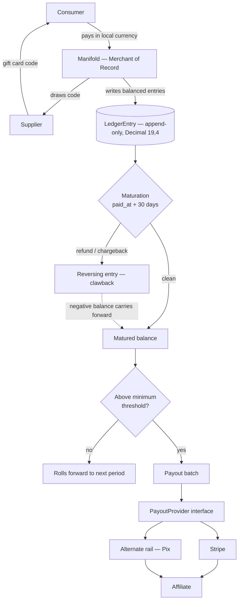
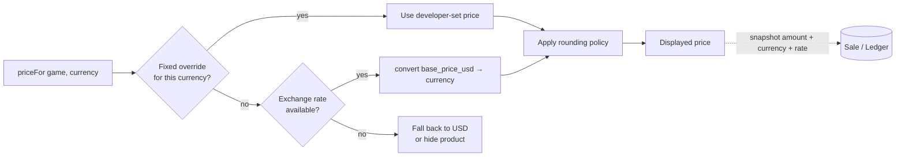
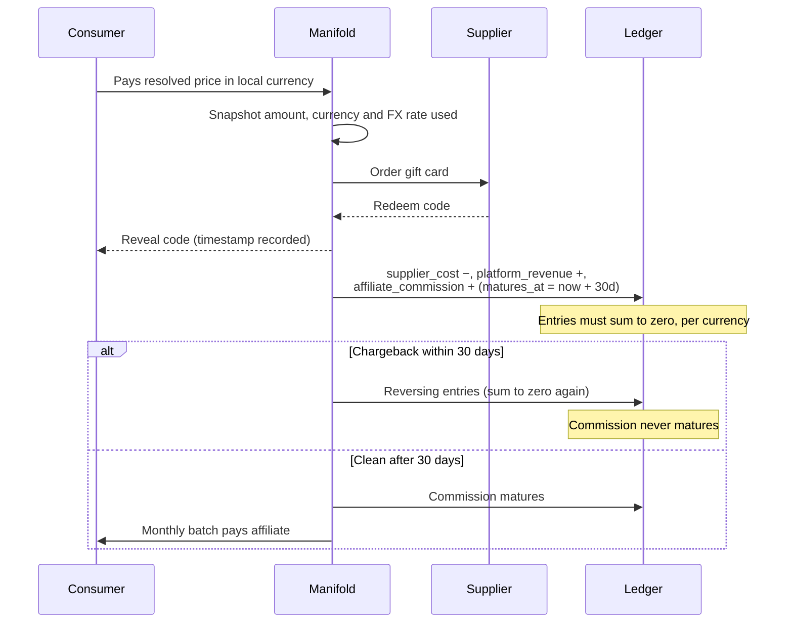

# Payments — Ledger, Multi-Currency Pricing & Payouts

Delivery plan for [#177](https://github.com/pedromello/manifoldpowered.com/issues/177) (Milestone 3: Payment Structure — Sales and Payouts).

For the runtime design of the pricing path — how a game gets a price in the visitor's currency, and why the modules are split the way they are — see [`payments-architecture.md`](./payments-architecture.md).

**Status: in progress.** The design is also under public discussion, so tasks not yet started may still change.

| Task                                     | State                                                                          |
| ---------------------------------------- | ------------------------------------------------------------------------------ |
| 2. Money → `Decimal(19,4)`               | ✅ done ([#181](https://github.com/pedromello/manifoldpowered.com/pull/181))   |
| 3. Currency + exchange rate model        | ✅ done ([#182](https://github.com/pedromello/manifoldpowered.com/pull/182))   |
| 4. Price resolution                      | ✅ done ([#183](https://github.com/pedromello/manifoldpowered.com/pull/183))   |
| 4a. Admin currency + rate endpoints      | ✅ done ([#184](https://github.com/pedromello/manifoldpowered.com/pull/184))   |
| 4b. Studio price override endpoints      | ✅ done                                                                        |
| 4c. Backoffice UI for currencies + rates | ✅ done ([#186](https://github.com/pedromello/manifoldpowered.com/pull/186))   |
| 4d. Currency selection by region header  | ✅ done ([#188](https://github.com/pedromello/manifoldpowered.com/issues/188)) |
| 5–11 (ledger, payouts)                   | not started                                                                    |

Each task is a separate small PR, landed in order, with `npm run test` passing on its own before merge — the same format as `docs/backoffice-tasks.md`.

**Ordering principle (revised after task 4).** Tasks 2–4 shipped three PRs of data layer with nothing reachable, which is too much invisible infrastructure to stack. From here, each piece of plumbing is followed by the endpoints that make it usable, so every PR is independently testable and delivers something. Task 1 ("register features up front") is dissolved into this: features get registered by the PR that introduces the endpoint needing them, when their shape is actually known.

---

## The model in one paragraph

Manifold is the **merchant of record**. Consumers buy from us; storefront owners are **marketing affiliates** who never take title, never set prices and never touch consumer money. We collect the full payment, hold the affiliate's commission for 30 days so refunds and chargebacks can resolve, then pay a **periodic lump sum** per affiliate — a real fiscal payment against a statement, the way Steam pays developers. This is deliberately _not_ a per-transaction payment split.

## Settled decisions

These are no longer open. They constrain everything below.

- **Money is `Decimal(19,4)`** everywhere — ledger, prices, payouts. Four decimal places is the standard scale for tax-inclusive amounts, where intermediate calculations need more precision than the two decimals a currency displays. This replaces the current `String @db.VarChar(20)` convention, and existing money columns migrate to it (task 2) rather than leaving two representations in the codebase.
- **USD is the base currency.** Every product carries a USD price. Other currencies are derived.
- **Price resolution is override-first:**
  ```
  priceFor(game, currency) = fixedPriceOverride(game, currency)
                          ?? convert(game.base_price_usd, currency)
  ```
  A developer-set fixed price for a currency always wins. Absent one, the price is converted from USD.

## Money flow



## Price resolution



## One sale, end to end



---

## Tasks

### 1. Foundation — features (dissolved)

**Superseded.** This task planned to register all payment features up front. In practice the feature list only becomes knowable once the endpoint shape is decided, and registering names early risks a rename plus a backfill later. Features are now registered by whichever PR introduces the endpoint that needs them.

Two things from the original task still apply to every PR that adds a feature:

- `filterOutput` returns `{}` for unhandled features, so a missing branch silently empties the response body rather than failing loudly. Every new feature needs its own branch.
- Adding to `ACTIVATED_USER_FEATURES` changes an array that four existing test files assert with whole-object equality, so those fixtures must be updated in the same PR. Adding to `ADMIN_ONLY_FEATURES` does not have that problem. Existing admins pick new admin features up from `npm run features:backfill` (or the backoffice "Reconcile feature grants" button) — `reconcileAll()` has an admin pass that tops up anyone already holding at least one admin-only feature. It cannot promote a non-admin. `npm run admin:grant -- --email=<email>` remains available for granting admin to a specific account.

---

### 2. Money representation — migrate to `Decimal(19,4)`

**TLDR:** Convert existing money columns from decimal-as-string to real numeric, before building anything financial on top of them.

`Game.price`, `Game.base_price` and `Sale.price_at_sale` are `String @db.VarChar(20)` today. That already forces raw `::numeric` SQL for range filters in `game.findAllPaginated`, and makes `orderBy: { price: "asc" }` sort lexicographically, which is subtly wrong. Building a ledger on a second, different representation would lock that split in permanently.

Migration is a hand-written SQL data migration (precedent: `20260723060000_lowercase_store_tag_filters`) doing `ALTER TABLE ... USING price::numeric`.

**Watch out:** Prisma returns `Decimal` objects, not numbers. Every API response must serialise them explicitly in `filterOutput` — the same treatment `GameFile.size_bytes` already gets with `.toString()`. Zod input schemas keep accepting a number and convert on the way in.

**Done when:** no money column is a string, price sorting and range filters use native numeric comparison, the raw `::numeric` workaround in `game.findAllPaginated` is deleted, and the full suite passes.

---

### 3. Currency + exchange rate model

**TLDR:** A table of supported currencies and a table of rates, so prices in non-USD currencies can be derived rather than hand-maintained.

`Currency` — code (ISO 4217), display symbol, decimal places for presentation, enabled flag. `ExchangeRate` — base currency, quote currency, `rate Decimal(19,8)`, source, `effective_at`. Rates are append-only and read newest-first, so historical conversions stay reproducible.

Three ways a rate arrives, all writing to the same table:

1. **Automatic** — a fetch from an external rate provider, run as a batch job.
2. **Pre-made table** — rates loaded in bulk, e.g. a monthly fixed set agreed in advance.
3. **Manual** — an admin writes a rate directly.

The consumer of this table doesn't care which produced it.

**Done when:** a rate can be recorded and the newest effective rate for a currency pair can be read back.

---

### 4. Price resolution

**TLDR:** `priceFor(game, currency)` — a developer's fixed price wins; otherwise convert from USD.

`GamePriceOverride` — `game_id`, `currency`, `amount Decimal(19,4)`. Its presence means "this is the price in this currency, do not convert."

```
priceFor(game, currency) = fixedPriceOverride(game, currency)
                        ?? convert(game.base_price_usd, currency)
```

Two decisions this task settled:

- **Missing price → hide the product.** If there is no rate and no override, the item does not appear for that currency. It never falls back to USD, because showing a price in the wrong currency is worse than showing nothing. This is why `resolvableGameIds` exists alongside `priceFor`: listing queries have to filter too, or the item shows up in search and only breaks on the detail page.
- **Rounding is half-up to the currency's `decimal_places`.** No psychological endings in the conversion path — a commercially-shaped price like 49.90 is set as an override instead, which keeps conversion a plain, auditable calculation.

A disabled currency behaves exactly like an unregistered one, so turning a currency off removes it from every storefront without deleting any price.

**Done when:** resolution is a single tested function used by every read path, both branches are covered, and rounding and missing-price behaviour are documented in code.

**Still open:** how the platform decides which currency a visitor sees. There is no user preference or region detection modelled yet — `priceFor` takes the currency explicitly, and choosing it is a separate task.

**Constraint that must not break:** this is developer/admin pricing only. **Storefront owners must never gain price control** — that is what keeps them affiliates rather than sellers (`docs/legal/phase-0-checklist.md`). Overrides are set at the catalog level, never per store.

---

### 5. Ledger, payout account and payout schema

**TLDR:** Three new tables, all money as `Decimal(19,4)`, all carrying an explicit currency, no foreign keys.

`LedgerEntry` is append-only (no `updated_at`), carries a **signed** amount, and references its source polymorphically (`source_type` + `source_id`) so it can point at a `Sale` today and an `Order` later without a migration. `Payout` gets a uniqueness constraint on `(user_id, period_start, period_end)` so a re-run can't double-pay.

**Every money row stores its currency, and any row produced by a conversion also stores the rate used.** Without the rate snapshot, a sale converted at last month's rate cannot be reconciled or audited later.

**Done when:** migration created via `npm run migrate:create` and the suite passes.

---

### 6. Ledger model

**TLDR:** The accounting core — write balanced entry sets, never update a row, reverse by writing negatives.

`record()` accepts a set of entries and **rejects any set that does not sum to zero within a currency**. That single invariant is what makes the ledger auditable: every money movement is balanced by construction, and a bug that loses money fails at write time instead of surfacing in a payout three weeks later. `reverse()` writes a new negative entry rather than mutating the original, so history is never rewritten.

Balances are **per currency**. A single affiliate can hold a BRL balance and a USD balance simultaneously; they are never silently added together.

**Done when:** balance and matured-balance queries work per currency, the zero-sum rule has unit tests, and the orchestrator can seed ledger entries.

---

### 7. Provider interface + Stripe adapter

**TLDR:** Make the payout rail swappable before writing the first one.

Four methods — `createAccount`, `getAccountStatus`, `sendPayout`, `getPayoutStatus` — with a registry keyed on the `provider` column. Stripe implements it first; an in-memory fake implements it for tests so the payout path is exercisable without network.

Providers declare which currencies they can pay in, so the payout run can route a BRL balance to a rail that reaches Pix and a USD balance to Stripe.

**Done when:** the fake and Stripe adapters satisfy the same interface and the call sites never import a provider directly.

---

### 8. Payout account model + endpoints

**TLDR:** Affiliates register where their money should go; nothing is payable until verification passes.

Create and read a `PayoutAccount`, with `payouts_enabled` defaulting to false and a preferred payout currency. The output filter must never expose the provider's external account ID — or, later, tax identifiers.

**Done when:** both endpoints follow the standard router chain, validate with Zod, and pass every response through `filterOutput`.

---

### 9. Maturation + clawback

**TLDR:** The 30-day hold, implemented as a batch job.

Commission becomes payable at `matures_at` if no reversing entry exists against its source. A chargeback writes the reversal; if the commission was already paid out, the negative balance carries forward against future earnings **in the same currency**.

This repo has no scheduler, so this follows the existing precedent for batch work: a model function returning a report, callable from a `tsx` script, a GitHub `workflow_dispatch` job, and an admin-gated endpoint that writes an audit log entry.

**Done when:** a matured balance excludes anything reversed, and a clawback after payout produces a carried negative balance.

---

### 10. Payout run

**TLDR:** Monthly batch — pay everyone whose matured balance clears the threshold and whose verification is done.

Writes the `Payout` row and its balancing ledger entries in one transaction, then calls the provider. Sub-threshold balances roll forward with no row written. Idempotent per period.

If a balance must be converted to the affiliate's payout currency, the conversion is itself a pair of ledger entries with the rate recorded — never an untracked adjustment.

**Done when:** the run is safely re-runnable, blocked for unverified accounts, correct across multiple currencies, and audit-logged.

---

### 11. Affiliate-facing reads

**TLDR:** Let affiliates see their own earnings — and nothing else.

Statement and payout history endpoints, gated by the base feature in the router plus a resource-scoped ownership check in the handler. Balances shown per currency. **Never** buyer personal data, never gift card codes.

**Done when:** an affiliate can see their own numbers and provably cannot see another store's.

---

### 4a. Admin currency + exchange rate endpoints

**TLDR:** Backoffice CRUD so currencies and rates can be managed without touching the database.

`GET`/`POST /api/v1/backoffice/currencies`, `GET`/`PATCH /api/v1/backoffice/currencies/[code]`, `GET`/`POST /api/v1/backoffice/exchange-rates`. Every mutation writes an `AdminActionLog`.

The currency code is immutable — it is the logical reference every rate and override points at, and with no foreign keys a rename would orphan them silently.

**Done when:** an admin can register a currency and record a rate through the API. ✅

---

### 4b. Studio price override endpoints

**TLDR:** Let whoever manages a game set its price per currency.

`GET /api/v1/items/games/[slug]/prices` returns one row per enabled currency, showing exactly what a buyer in each would see — including the currencies where the game is unavailable, which is the case most worth noticing. `PUT`/`DELETE /api/v1/items/games/[slug]/prices/[currency]` set and clear an override.

Authorization reuses the `update:game` resource branch: `read:game_price` and `update:game_price` resolve through the game's studio, and both are in `studio.MEMBER_PERMISSIONS`. Anyone who can already change a game's USD price has no reason to be blocked from its price in another currency. Existing studio owners pick the new permissions up from `npm run features:backfill`, which reconciles studio owners against `MEMBER_PERMISSIONS`.

**Done when:** a studio owner can price a game in every enabled currency and see where it is unavailable. ✅

---

### 4c. Backoffice UI for currencies and exchange rates

**TLDR:** Screens for the endpoints from 4a, so currencies and rates are managed without curl.

Follows the existing backoffice conventions (`BackofficeLayout`, Tailwind, SWR, `lucide-react`) and the ground rules in `docs/backoffice-tasks.md`: server-side `canRequest` already enforces access, client gating is cosmetic, and every mutating action gets a confirm dialog naming the resource.

Screens: a currency list with create and edit, and a rate list filtered by pair with a form to record a new rate. Disabling a currency needs a confirm dialog that says plainly it hides every product priced in that currency.

**Done when:** an admin can register a currency, toggle it, and record a rate entirely from the UI. ✅

Two details worth keeping if these screens are extended:

- The currency **code** is disabled in the edit form, with the reason shown inline. It is the reference every rate and override points at, so it can only be set at creation.
- Rates whose `effective_at` is in the future are badged **Scheduled**, because a rate that exists but is not affecting prices yet is otherwise indistinguishable from one that is.

---

### 4d. Currency selection by region

**TLDR:** Decide which currency a visitor sees, from a geolocation header. This is what finally makes the pricing work visible to a buyer.

`models/region.ts` reads Vercel's `x-vercel-ip-country` and maps it to a currency, falling back to the base currency whenever the region is unknown, unmapped, ungeolocatable (`XX`), or maps to a currency that is not enabled. The country→currency map is static in code rather than a table: it is a property of the world, not of the catalogue, so a database copy could only ever be edited to be wrong.

`models/storefront_pricing.ts` centralises what every storefront read needs, because seven endpoints require identical behaviour and a storefront that prices differently depending on which list a game came from is worse than one that never localises.

Responses gain `display_price` (`amount`, `base_amount`, `currency`, `symbol`) alongside the untouched USD `price`, so the change is additive.

**Two things worth remembering:**

- **Filtering happens in the query, not after it.** `findAllPaginated` takes `priceableGameIds`; post-filtering a page of 20 could render 15 while pagination still claimed 20.
- **The base currency works unregistered.** With no currency rows at all the platform still sells in USD, and localisation is purely additive. Treating an unregistered base currency as unpriceable would have emptied the entire storefront the moment this shipped unconfigured.

**Done when:** a visitor in a mapped region with a rate sees local prices, and products with no price in their currency are absent from listings and 404 on detail. ✅

---

## Open questions

1. **FX cost bearer** — when a sale is collected in BRL and commission is paid in USD, who absorbs the conversion spread? Currently assigned to the affiliate in the agreement draft.
2. **Rate staleness** — how old is too old? A rate table with no freshness policy will eventually sell something at a two-month-old rate.
3. **Scope** — ledger and payouts first, with checkout and an `Order` model later. Is the polymorphic source reference the right seam?
4. **Tax fields** — deferred until the tax position is written, with payouts hard-gated meanwhile.
5. **Scheduling** — batch jobs are manually triggered (script / workflow / admin endpoint) because there's no scheduler.

**Resolved:** money representation is `Decimal(19,4)`; USD is the base currency; price resolution is override-first with conversion as fallback.
